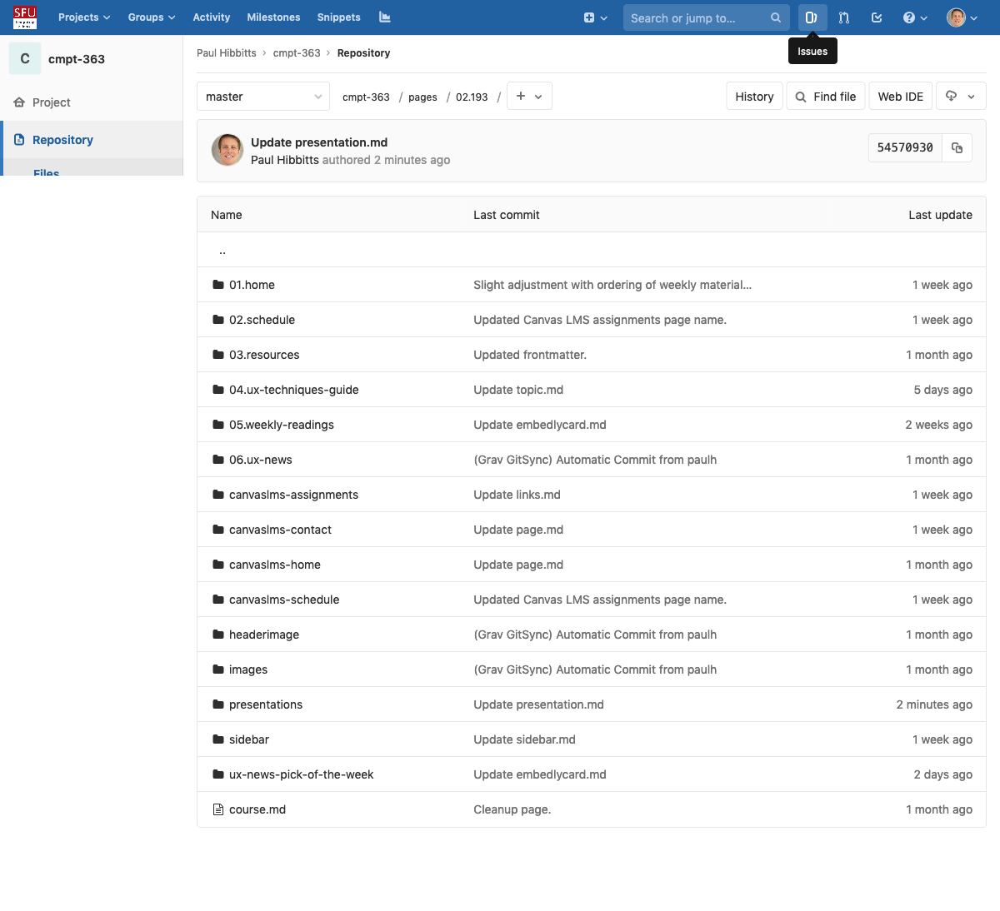
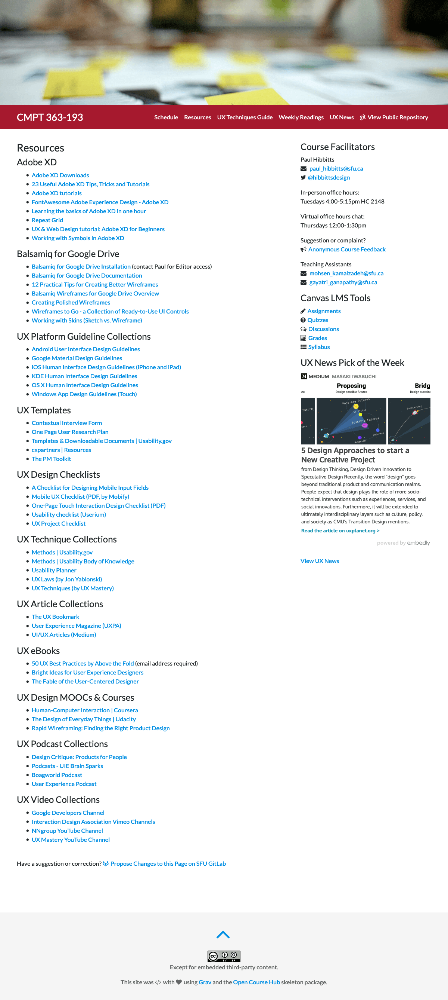
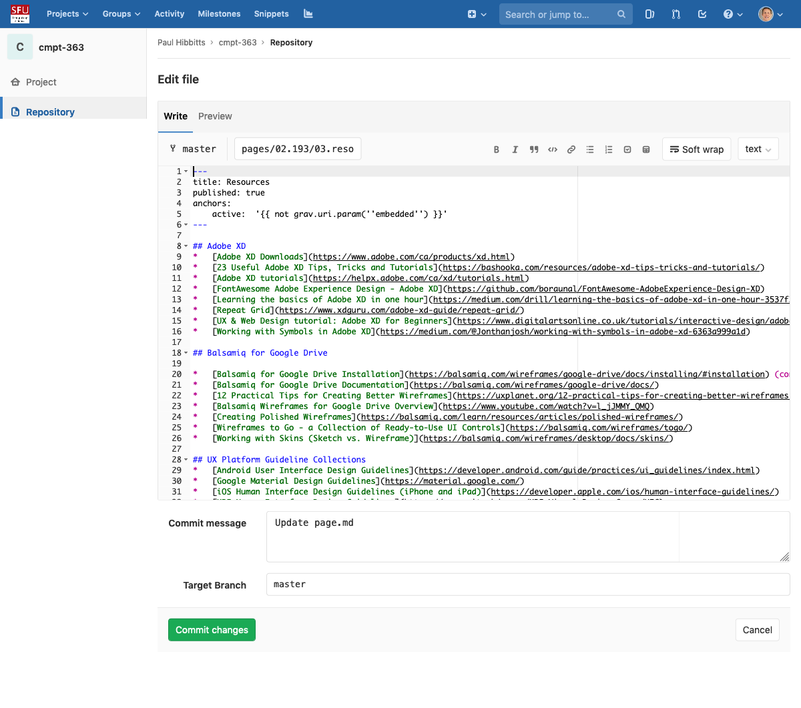
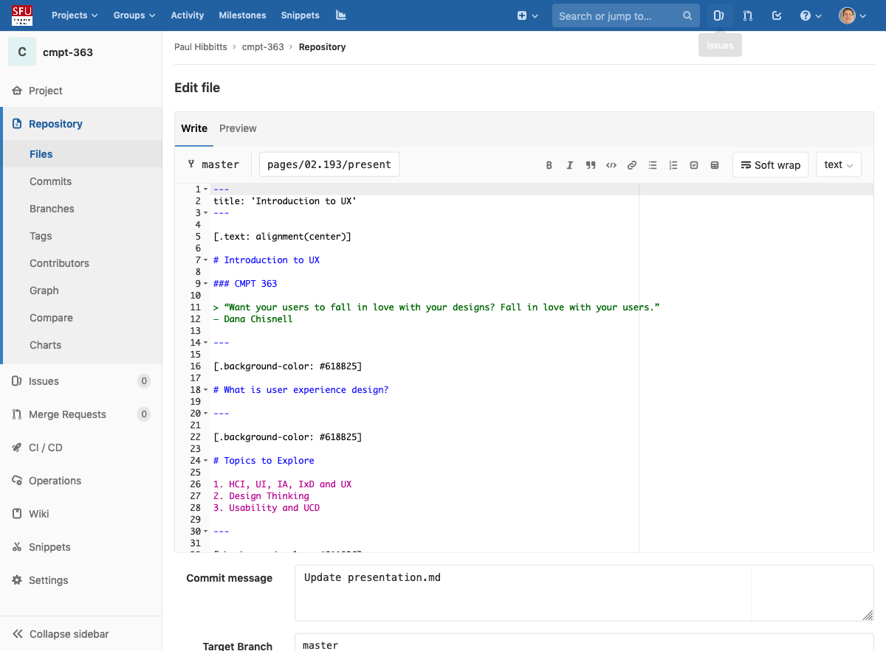

[.text: alignment(center)]  

# Course Overview

### CMPT 363

> “When software is hard to use, don’t make excuses for it. Improve it. When a user makes a mistake, don’t blame the user. Ask how the software misled them. Then fix it. The user’s time is more valuable than ours. Respect it. Good UI design is humble.”
— Jono DiCarlo

##### _Please take a seat in the front half of the theater, thank you!_

---

<div class="grav-youtube">
    <iframe src="https://www.youtube.com/embed/1BB6wj6RyKo?start=0&end=96" frameborder="0" allowfullscreen></iframe>
</div>

---


---


---

# Instructor

Paul Hibbitts  
[safe-email autolink="true" icon="envelope"]paul_hibbitts@sfu.ca[/safe-email]  
[fa icon="twitter"] [@hibbittsdesign](https://twitter.com/hibbittsdesign)  

In-person office hours:  
Tuesdays 4:00-5:15pm HC 2148  

Virtual office hours chat:  
Thursdays 12:00-1:30pm  

---

# About Me

* Educator, Interaction Designer, and Open Source Author
* (Recovering) User Experience Consultant,
established Hibbitts Design in 1998
* Current focus is creating open source software for the field of education
* 125+ successful software UX projects, with 40+ clients such as SAP BusinessObjects, The Canadian Real Estate Association and The University of British Columbia
* Usability Mentor, 2009 Season of Usability
(co-sponsored by Google)
* Human Factors International (HFI) Certified Usability Analyst
* Instructor at Simon Fraser University, since 1997

---

[.background-color: #FFFFFF]


---


---

[.background-color: #FFFFFF]


---

# Teaching Assistants

Mohsen Kamalzadeh  
[safe-email autolink="true" icon="envelope"]mohsen_kamalzadeh@sfu.ca[/safe-email]  

Gayatri Ganapathy  
[safe-email autolink="true" icon="envelope"]gayatri_ganapathy@sfu.ca[/safe-email]  

In-person office hours:
As required

---

[.background-color: #2d6e92]
[class=activity-link-color]
[.header: alignment(center),#FFFFFF]

# _Ok, so what do you want to learn in this class?_

---

# Course Learning Objectives

* Describe and apply key UI/UX concepts, techniques, and principles
* Assess and describe the usability and UX of a digital interface
* Plan, conduct, and analyze user research for a digital product
* Conceptualize, design, and prototype a digital product
* Apply the core principles of effective visual design
* Plan, conduct, and analyze a usability test of a digital product

---

# Course Objectives One-liner
<br>

---

# Course Objectives One-liner

### “Problem-solving​”
<br>

---

# Course Objectives One-liner

### “~~Problem-solving~~”
<br>

---

# Course Objectives One-liner

### “________ problem-solving”
<br>

---

# Course Objectives One-liner

### “Empathetic problem-solving”
<br>

---

# Course Objectives One-liner

### “Empathetic problem-solving ____________________”
<br>

---

# Course Objectives One-liner

### “Empathetic problem-solving aligning people, business and technology.”
<br>

---

# Additional Course Objectives

* Participate and contribute as a member of a product team
* Care about how people feel about and experience technology

---

[.build-lists: true]

# 🚨Reasons To Avoid This Course🚨

* Weekly readings, along with a quiz, are required
* Frequent in-class individual and group exercises
* Group assignment(s) are mandatory
* Assignments will require a substantial amount of effort
* Satisfactory peer reviews may be a requirement to group assignments
* Good communication _and_ writing skills are critical  
* It is a design course, where assessments will often be determined on subjective opinion (primarily mine)
* I expect your designs to be more than just usable (also useful and desirable)
* Instructor feedback and critique sessions
* Getting A’s in other computer science courses has little relevance in this course
* Final exam (40%), more on that later!

---

[.build-lists: true]

# Reasons Why You Might Want To Stick Around

* A ~~good~~ great UX is now a software industry expectation
* Poorly designed interfaces cost money, require additional support, and waste people’s valuable time
* A basic understanding of user experience design processes and techniques will be helpful when working in the software industry
* You will experience how to work on design challenges
within teams
* The user-centered design process and techniques that you will learn can be applied to many other domains
* You have the opportunity to learn from an experienced UX practitioner, open source author, and educator ([ca.linkedin.com/in/paulhibbitts/](http://ca.linkedin.com/in/paulhibbitts/))

---

# Course Outline as Topics

* Design Research
* User-Centered Design
* Interaction Design
* Multi-platform Design
* Usability Evaluation

---

# ~~Course Outline as Topics~~

* Design Research
* User-Centered Design
* Interaction Design
* Multi-platform Design
* Usability Evaluation

---

# Course Outline as Questions

* What is usability and user experience design?
* What does a holistic user experience design process look like?
* How to understand and communicate people’s needs and behaviors?
* What is the practice of strategic interaction design?
* How to bridge the gap between the problem space and design space?
* How to explore and communicate possible design solutions?
* What are the essentials of effective visual communication?
* How to design for mobile and multi-device usage?
* How to conduct a usability inspection?
* How to plan, conduct, and summarize usability tests?

---

# One Minute Wrap-up Summary (A.K.A. Bonus Points Opportunity)

Immediately after (due 12 midnight the day of class) you will be asked to write down and answer via the [Canvas Class Discussion Board](https://canvas.sfu.ca/courses/47119/discussion_topics) the most valuable thing you learned, and any questions that you may still have.

---

# Required Textbook

---

# Required Textbook

Are you kidding me, in 2019? All required readings will be available on-line.

---

# Midterms and Final Exams

---

# Midterms and Final Exams

No midterm, but a final exam worth 40%, and...

---

# Midterms and Final Exams

The final exam questions will be (most likely) written by you 🎉

---

# Weekly Review Quizzes

Create one potential **question** using a multiple-choice or short answer format, with the **correct answer**, to test student understanding of that material

---

# Weekly Review Quizzes

The creation of course assessment questions is a valuable learning exercise for students, as it moves beyond the simple recollection of facts to a deeper analysis of course material. This approach also increases student involvement with their final exam experience.

---

# Weekly Review Quizzes

Assessment Guidelines (your input welcome!)

* Relevance (i.e. linkages to course materials and valuable in creation of effective user interfaces)
* Level (i.e. level of learning - evaluation or creation, application or analysis, and remembering or understanding - and level of intellectual challenge)
* Clarity (i.e. clear, concise, and well organized writing)

---

# Weekly Review Quizzes

* [Asking Good Test Questions](https://teaching.cornell.edu/teaching-resources/assessment-evaluation/asking-good-test-questions)
* [Writing multiple choice questions using Bloom’s Taxonomy](https://gradehub.com/blog/using-multiple-choice-questions-using-blooms-taxonomy/) (includes examples of multiple choice questions to assess different levels of learning)
* [Different Types of Questions based on Bloom's Taxonomy](http://faculty.academyart.edu/faculty/teaching-topics/teaching-curriculum/enhancing-teacher-student-interaction/different-types-questions-blooms-taxonomy.html) (includes examples of short answer questions to asses different levels of learning)

---

# Weekly Review Quizzes

[A practice weekly quiz](https://canvas.sfu.ca/courses/47119/assignments/392966) (not graded) is now available, due by Friday Sep 6th. Example questions + answers will be reviewed in the following class.

---

# Course Site

A multi-device friendly course site is available. All materials are also available directly within Canvas.

[paulhibbitts.net/cmpt-363](http://paulhibbitts.net/cmpt-363) ([bit.ly/cmpt-363](http://bit.ly/cmpt-363))

I always want to hear from you how together we make our course site better. Be honest, I can take it.

---

# Quick Poll

❑ HTML  
❑ Markdown  
❑ CSS  
❑ Twig  
❑ YAML  
❑ PHP  
❑ GitHub/GitLab

---



[link-overlay="https://csil-git1.cs.surrey.sfu.ca/paulh/cmpt-363/tree/master/pages/02.193"]

---



[link-overlay="https://paulhibbitts.net/cmpt-363/193/resources"]

---



[link-overlay="https://csil-git1.cs.surrey.sfu.ca/paulh/cmpt-363/blob/master/pages/02.193/03.resources/page.md"]

---

[.text: alignment(center)]

# Introduction to UX

### CMPT 363

> “Want your users to fall in love with your designs? Fall in love with your users.”
— Dana Chisnell

---



[link-overlay="https://csil-git1.cs.surrey.sfu.ca/paulh/cmpt-363/edit/master/pages/02.193/03.resources/page.md"]

---

# Course Grading (tentative)

- Individual (50%)
 - Weekly Review Quizzes: 10%
 - Final Exam: 40%
- Group (50%)
 - User Research Report: 20%
 - Usability Tested Mockups: 15%
 - Interactive Prototype: 15%

---

# Group Assignments

### Two Options:

* Student group choice of open source app
* SFU’s Coursys app ([github.com/sfu-fas/coursys](https://github.com/sfu-fas/coursys))

---

# Assignment Policy

- Any assignment submitted may be shared/shown in class and online (with no student identification)
(with all student or group identity information removed if public)
- For every day the assignment is late after the due date, 10% of the maximum possible value will be deducted from the assignment (max 2 days)
- Deferrals or extensions will only be given on the basis of authenticated documentation
- Each group assignment group member may be subject to a participation assessment by all their group peers
- At my discretion, the grades of group members who are clearly not contributing a fair share of work may be adjusted​, including​ a grade of zero (0)

---

# Important Dates (Tentative)

- Form four person Project Groups
  - To be done by Sep 10th
- Open Source UX Project Proposal
  - Assigned Sep 10th, due Sep 23rd
- Group Assignment: User Research Report  
  - Assigned Oct 1st, due 21st (Draft user research plan due Oct 7th)  
- Group Assignment: Usability Tested Mockups  
  - Assigned Oct 22nd, due Nov 12th by 5:30pm (Draft designs due Nov 4th)
- Group Assignment: Interactive Prototype  
  - Assigned Nov 12th, due Nov 25th
- Final Exam
  - Tentatively Dec 10th at 7:00pm

---

# Some Items of Recent Interest...

- The Reaction to the New Twitter Design
- How can we Build Human-Centred Products by Kim Goodwin
- Open Source User Experience Design Challenges

---

<blockquote class="twitter-tweet" data-lang="en" align="center"><p lang="en" dir="ltr">Well. This is remarkably ugly, isn&#39;t it?<a href="https://twitter.com/hashtag/NewTwitter?src=hash&amp;ref_src=twsrc%5Etfw">#NewTwitter</a> <a href="https://t.co/mJVePZDfsw">pic.twitter.com/mJVePZDfsw</a></p>&mdash; Stephen Farrow #FBPE (@stephenfarrow) <a href="https://twitter.com/stephenfarrow/status/1150824841202847746?ref_src=twsrc%5Etfw">July 15, 2019</a></blockquote>
<script async src="https://platform.twitter.com/widgets.js" charset="utf-8"></script>
---

[data-background-iframe="https://articles.uie.com/users-dont-hate-change-they-hate-our-design-choices/"]
[data-background-interactive]

---

[data-background-iframe="https://medium.com/meilleursagents-engineering/mind-the-product-2018-make-the-world-a-better-place-kim-goodwin-1dd17415543b"]
[data-background-interactive]

---

[data-background-iframe="https://www.redhat.com/en/blog/designing-better-user-experience-open-source-software"]
[data-background-interactive]

---

[data-background-iframe="https://arxiv.org/pdf/1902.07704.pdf"]
[data-background-interactive]

---

[.background-color: #000000]


---

# Thank you!

### Questions or Comments?

---

[.background-color: #888888]

# Image Credits

```
http://www.forbes.com/sites/anthonykosner/2013/11/23/how-design-and-user-experience-translates-to-the-bottom-line/  
https://rosenfeldmedia.com/eux2018/trip-notes-roadmap-maturing-design-enterprise-jj-kercher/  
https://blog.fastmonkeys.com/2014/06/18/minimum-viable-product-your-ultimate-guide-to-mvp-great-examples/  
https://rosenfeldmedia.com/eux2018/trip-notes-roadmap-maturing-design-enterprise-jj-kercher/  
https://blog.fastmonkeys.com/2014/06/18/minimum-viable-product-your-ultimate-guide-to-mvp-great-examples/  
https://www.interaction-design.org/literature/article/a-simple-introduction-to-lean-ux  
```
