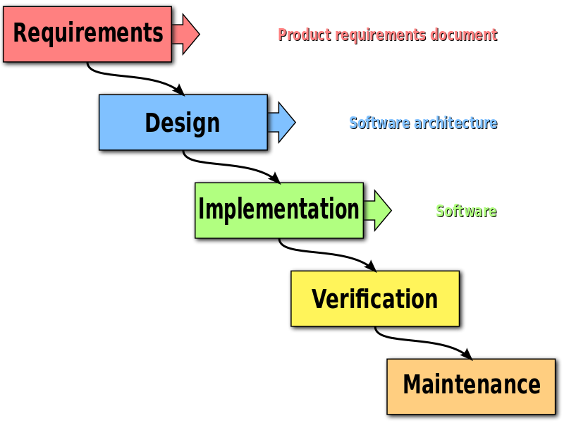
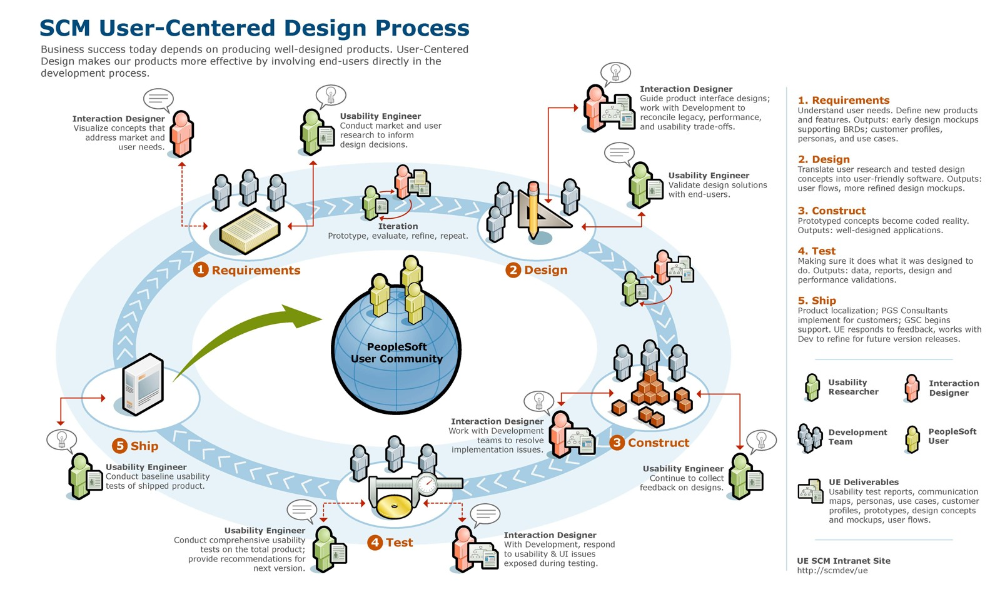
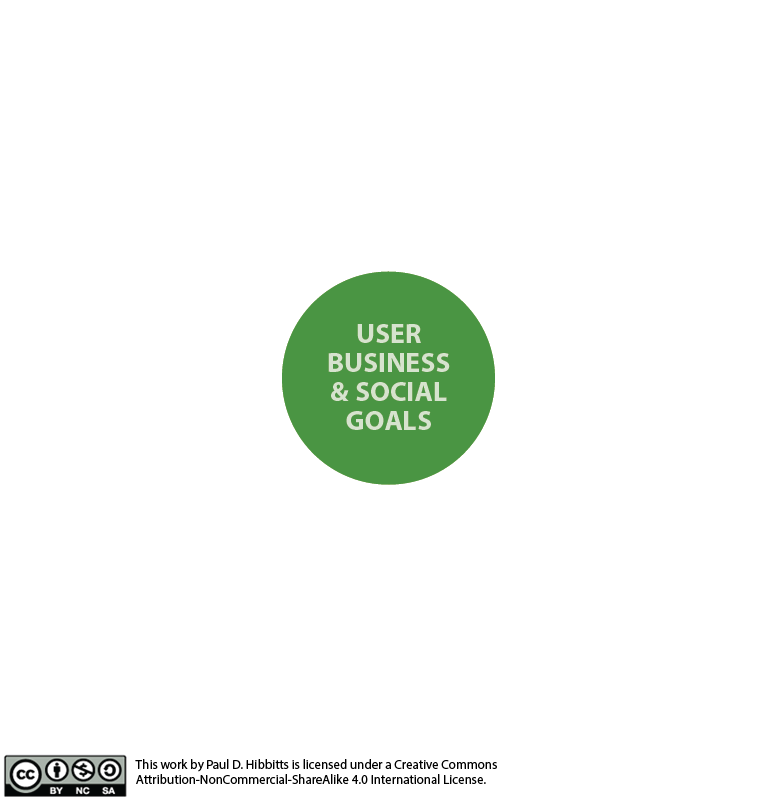
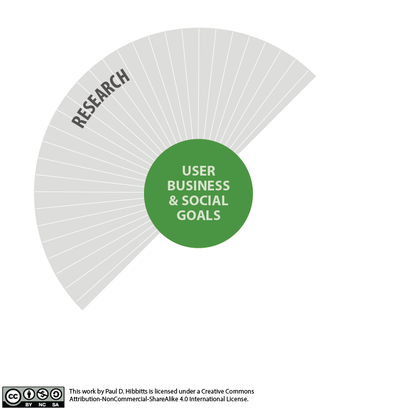
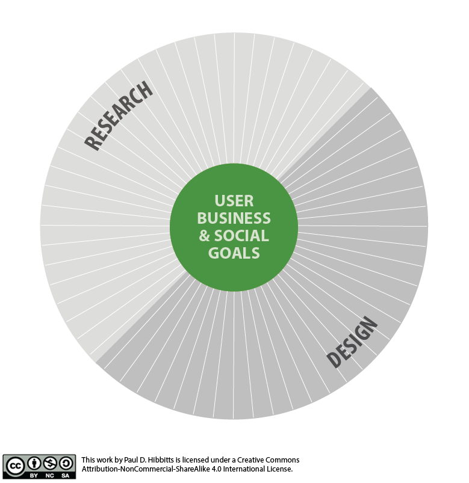
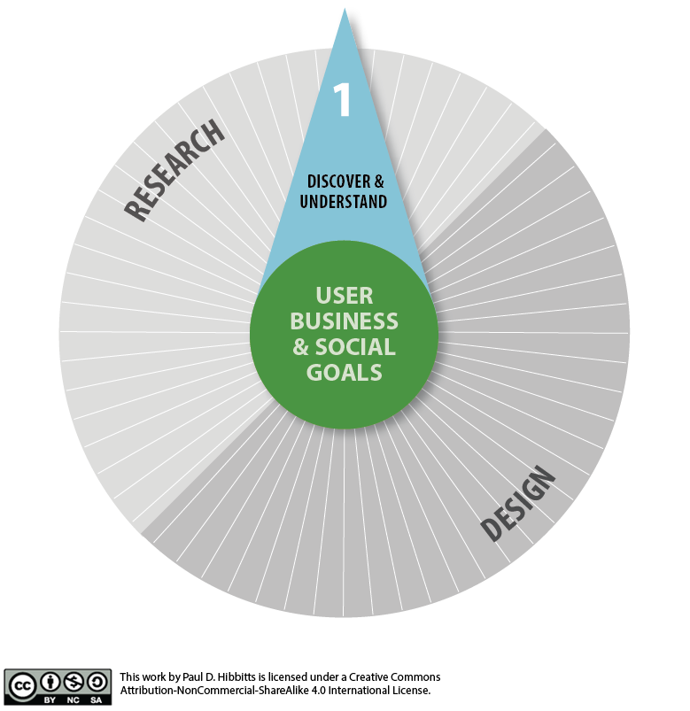
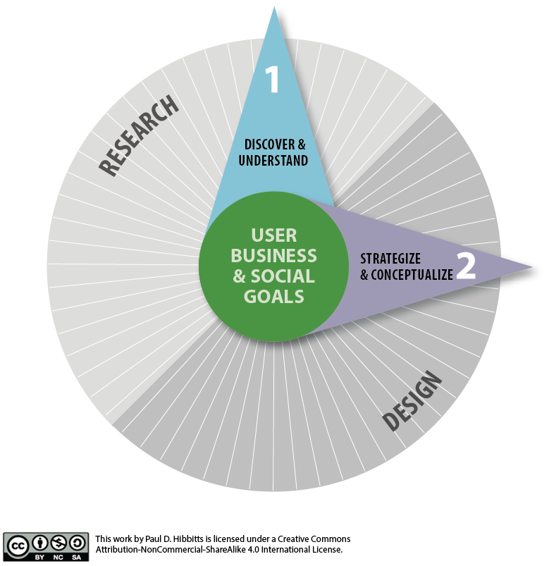
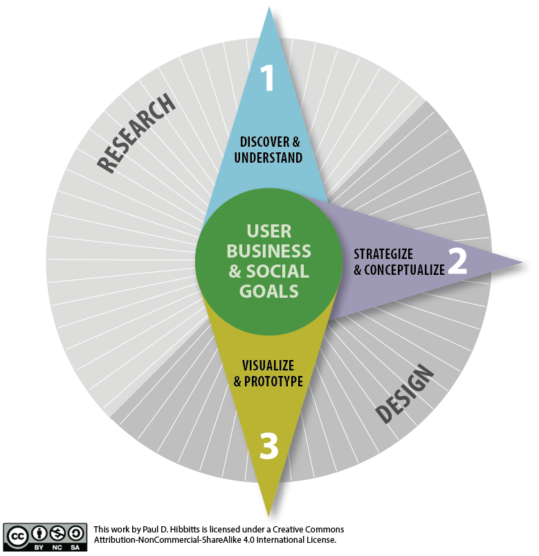
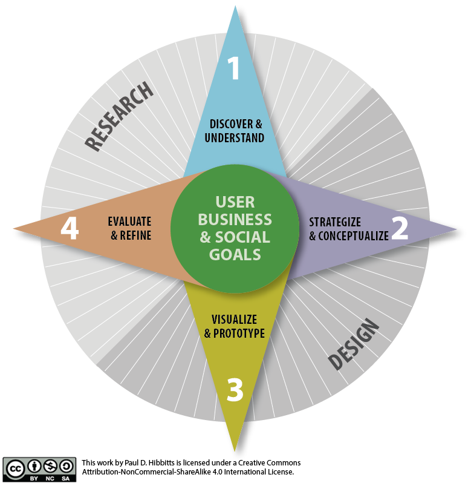
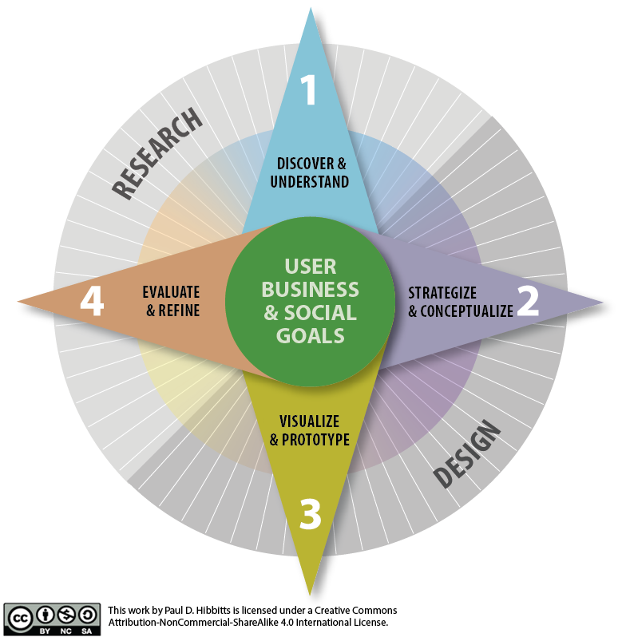

[.text: alignment(center)]

# The Process of UX Design

### CMPT 363

> “Design isn’t finished until somebody is using it.”  
— Brenda Laurel

---

[.background-color: #618B25]

# _What does a holistic user experience design process look like?_

---

[.background-color: #618B25]

# Topics to Explore

1. Software Development Processes
2. User Experience Design Processes
3. Our Design Process (aka Toolkit)

---

[.background-color: #611036]

# What does a holistic user experience design process look like?
### Software Development Processes

---

[.background-color: #FFFFFF]



---

# WaterFall Challenges

* Software development as pure production
* Knowing all required information upfront
* Time estimates are extremely hard to make
* Often entire project must be completed to fully test
* Long feedback and development cycles

---

[.background-color: #2d6e92]
[class=activity-link-color]
[.header: alignment(left),#FFFFFF]

# Activity: Pop Quiz

Courtesy of the Safari Books Online course ‘Agile for Everybody - The Essentials of Agile and Lean’ by Matt LeMay

---

[.background-color: #2d6e92]
[class=activity-link-color]

**True or False?**
Agile and Lean are about doing things faster

---

[.background-color: #2d6e92]
[class=activity-link-color]

**True or False?**
Agile and Lean are rigid frameworks

---

[.background-color: #2d6e92]
[class=activity-link-color]

**True or False?**
Agile and Lean are only for software developers

---

[.background-color: #FFFFFF]


---

# Agile Manifesto

Individuals and interactions over processes and tools  
Working software over comprehensive documentation  
Customer collaboration over contract negotiation  
Responding to change over following a plan

---

[.background-color: #FFFFFF]


---

# *With Agile we can combine iterative design with incremental development...*

---

[.background-color: #FFFFFF]


---

# Lean Development (based on the Toyota Way)(1)

* A mindset, or **way of thinking**, commitment to achieve a totally waste-free operation that’s focused on your customer’s success
* It is achieved by **simplifying and continuously improving** all processes and relationships in an environment of trust, respect and full employee involvement
* It is about people, simplicity, flow, visibility, partnerships and true value **as perceived by the customer**

(1): Source: David Hogg, High Performance Solutions, 2008

---

[.background-color: #FFFFFF]


---

# With Lean each Design (Decision) is Viewed as a Hypothesis

A hypothesis can be defined as an educated guess that then can be tested to be shown correct

---

[youtube]https://www.youtube.com/watch?v=_w-NUOjwMto[/youtube]

---

# Example Hypotheses (includes outcome & assumption)

* We believe that our customers will find the “add to cart” button because it is highly visible
* We believe that our customers will be able to complete the checkout process because it is very simple

---

[.background-color: #2d6e92]
[class=activity-link-color]

# Activity: Write a Hypothesis

INDIVIDUAL OR TEAM  
Write a simple hypothesis for a design decision involving a change to the GoSFU course registration system

Format: We believe that [outcome] because [assumption]  

_Example Hypotheses (includes outcome & assumption)_  
We believe that our customers will find the “add to cart” button because it is highly visible  
We believe that our customers will be able to complete the checkout process because it is very simple  

---

# Waterfall vs. Agile vs. Lean?

---

[.background-color: #FFFFFF]


---

[.background-color: #611036]

# What does a holistic user experience design process look like?
### User Experience Design Processes

---

[.background-color: #FFFFFF]
[.header: #888888]



###### Source: PeopleSoft

---

[.background-color: #FFFFFF]


---

# *These look really detailed and appealing, but are they always practical?*

---

[.background-color: #FFFFFF]


---

[.background-color: #FFFFFF]


---

# *These look more approachable, but do they give enough specifics?*

---

[.background-color: #611036]
[.header: alignment(left),#FFFFFF]

# What does a holistic user experience design process look like?
### Our UX Design Process (aka Toolkit)

---

[.background-color: #FFFFFF]



---

[.background-color: #FFFFFF]



---

[.background-color: #FFFFFF]



---

[.background-color: #FFFFFF]



---

[.background-color: #FFFFFF]



---

[.background-color: #FFFFFF]



---

[.background-color: #FFFFFF]



---

[.background-color: #FFFFFF]



---

[.background-color: #FFFFFF]


---

# Our Process as a Toolkit (of Activities)

* Discover & understand
* Strategize & conceptualize
* Visualize & prototype
* Evaluate & refine

---

[.background-color: #92c3d5]
[.header: alignment(left),#000000]

# Discover & Understand

---

[.background-color: #FFFFFF]


---

# Discover & Understand

* Affinity diagrams
* Contextual inquiries
* Empathy maps
* Interviews
* Job stories
* Jobs to be Done
* Personas
* Proto-personas
* Surveys
* Task analysis
* Five Ws and one H
* The five whys
* User stories

---

[youtube]https://www.youtube.com/watch?v=1IwT2VD5CJo[/youtube]

---

# _What is the difference between a user goal and a task?_

---

# User Goal vs. Task

## Goals

* Things users want or need to achieve
* Tend to remain constant over time
* System independent
* Reaching a goal changes the state of the world

---

# User Goal vs. Task

## Tasks

* Must be performed to reach goals
* Tend to change over time, often due to technology
* System dependent
* May require problem solving

---

# Questions to Help Discover User Goals and Tasks

* Why would they use the system (goals)?
* What do they need to do to reach their goals (tasks)?
* What are common problems encountered?
* When would they use the system?
* Where would they be using the system?

---

[.background-color: #2d6e92]
[class=activity-link-color]
[.header: alignment(left),#FFFFFF]

# Activity: User Goals vs. Tasks

THINK-PAIR-SHARE  
Examples of student goals and tasks for using the GoSFU course registration system?

---

# Example Task Analysis Tools

* Task inventory (incl. frequency & importance)
* Task frequency & importance matrix
* Task sequences
* Flowcharts

---

# Task Importance & Frequency Matrix

| Task List | User Group #1 | User Group #2 | User Group #3 |
|---|---|---|---|
| Task #1 |  High/Frequent | High/Infrequent  | Low/Infrequent |
| Task #2 |  Never | Low/Infrequent | High/Frequent |
| Task #3 |  Low/Infrequent | Never  | High/Infrequent |
| Task #4 |  Low/Infrequent | Low/Infrequent | Low/Infrequent |

---

# Organizing an Interface by Tasks

* Important & frequent - higher visibility, fewer taps
* Important & infrequent - higher visibility, more taps
* Unimportant & frequent - lower visibility, fewer taps
* Unimportant & infrequent - lower visibility, more taps

---

[.background-color: #9d9bb4]
[.header: alignment(left),#000000]

# Strategize & Conceptualize

---

[.background-color: #FFFFFF]


---

# Strategize & Conceptualize

* Conceptual models
* Content strategy
* Journey maps
* Kano model
* Problem statement
* Product design principles
* Product Reaction Cards
* Seven stages of action
* Usability/UX goals
* Value Proposition
* Valuing UX

---

# Usability Goals - How it Works

* Learnability (first-time users)
 * The product should be easy to learn
* Efficiency (experienced users)
 * The product should be efficient to use
* Memorability (casual users)
 * The product should be easy to remember
* Error-resistance (all users)
 * The product should minimize usage errors

---

# Defining Usability Goals

* Common factors for consideration are
 * Frequency of use
 * Importance of task or need
 * Task structure (e.g. complexity, repetition)
 * Motivation/attitude
* Assign a priority to each goal (e.g. 1-3)
 * Could be specifically measured, but overall usability assessment (e.g. SUS) is usually sufficient

---

# UX Goals - How it Feels

* [Product Reaction Cards by Microsoft (2002)](http://www.microsoft.com/usability/UEPostings/ProductReactionCards.doc)
* 118 words (60% positive, 40% negative)
* Sample words
 * Appealing
 * Complex
 * Familiar
 * Hard to use
 * Organized
 * Relevant
 * Too technical
 * Valuable

---

# Defining UX Goals with Product Reaction Cards

* Select a set number of attributes (i.e. 4 to 8)
 * For each attribute, assign a priority and note reason
 * Consider visualizing results (e.g. word cloud)

---

[.background-color: #FFFFFF]


---
[.background-color: #bbb549]
[.header: alignment(left),#000000]

# Visualize & Prototype

---

[.background-color: #FFFFFF]


---

# Visualize & Prototype

* Content inventory
* Content prototyping
* Design patterns
* Task flow diagrams
* Platform design principles
* Responsive Web Design
* Storyboards
* Visual design principles
* Wireframes

---

# Content Prototyping

An approach where real content is utilized early on during a project for the creation of all prototypes

---

[.background-color: #FFFFFF]


---

[.background-color: #FFFFFF]


---

[youtube]https://www.youtube.com/watch?v=TisoPEnDQtE[/youtube]

---

[.background-color: #c79d78]
[.header: alignment(left),#000000]

# Evaluate & Refine

---

[.background-color: #FFFFFF]


---

# Evaluate & Refine

* 5-Second test
* Cognitive walkthrough
* Heuristic review
* Usability testing (informal and formal)

---

# Measuring Usability Goals

* Learnability (first-time users)
 * Can a new user complete a task?
* Efficiency (experienced users)
 * How fast can a user complete a task?
* Memorability (casual users)
 * How easy can a repeat user recall how to complete a task?
* Error-resistance (all users)
 * How often does the software cause users to make an error?

---

# Measuring UX Goals with Product Reaction Cards

* Measuring
 * Reduce attributes to ≈ 60 to 80
 * Ask participants to select most relevant 10
 * Visualize the results (e.g. word cloud)

---

[.background-color: #FFFFFF]


---

[.background-color: #2d6e92]
[class=activity-link-color]
[.header: alignment(left),#FFFFFF]

# Activity: Product Reaction Cards

* Pick one word to describe how you feel when using the GoSFU course registration system

---

[.background-color: #FFFFFF]


---

[.background-color: #618B25]

# Summary

* Software Development Processes
* User Experience Design Processes
* Our Design Process (aka Toolkit)

---

[.background-color: #888888]

# References and Suggested Books

* 100 Things Every Designer Needs to Know About People by Susan Weinschenk
* About Face 3: The Essentials of Interaction Design by Alan Cooper, Robert Reimann and David Cronin
* Lean UX by Jeff Gothelf
* The Design of Everyday Things by Donald A. Norman
* Rocket Surgery Made Easy by Steve Krug
* UX Team of One by Leah Buley

---

[.background-color: #888888]
[.header: #FFFFFF, alignment(left)]

# Image Credits (for images without source URL or note)

```
https://en.wikipedia.org/wiki/Waterfall_model  
```
