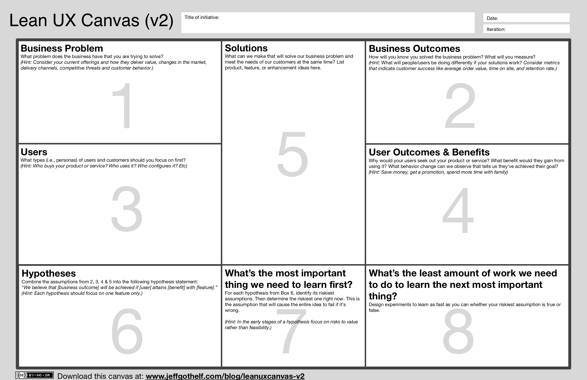
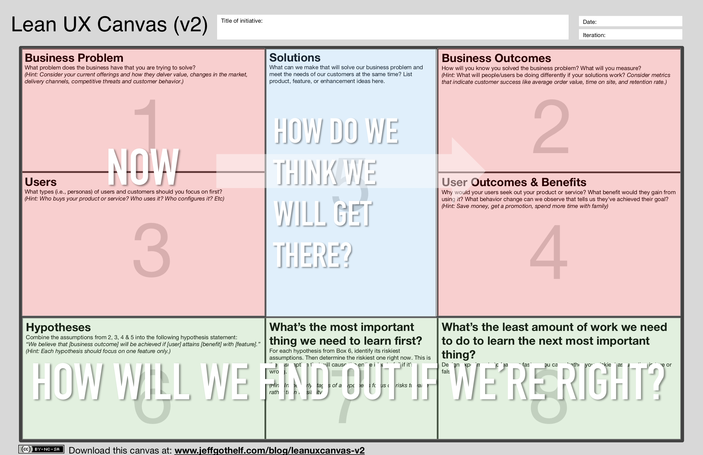

[.text: alignment(center)]

# UX Strategy

### CMPT 363

> “The idea is to focus development not only on the UX, but what the UX enables, and—most crucially—what we want to happen after the UX.”  
— Kathy Sierra

---

[.background-color: #618B25]

# _What is the practice of **strategic** interaction design?_

---

[.background-color: #FFFFFF]


---

# Think "Types of Activities" vs. "Phases/Steps" for our UX Toolkit

---

[.background-color: #FFFFFF]


---

[.background-color: #618B25]

# Topics to Explore
1. User Experience Strategy
2. Assessing Current State
3. Imagining Future State

---

[.background-color: #611036]

# How to make more strategic design decisions?

### User Experience Strategy

---

# A UX Strategy is the **plan** for the **user experience** you want to deliver

---

[.background-color: #FFFFFF]


---

[youtube]https://www.youtube.com/watch?v=sHzhjiuo01M[/youtube]

---

# _What is the difference between tactics and strategy?_

---

# Tactics vs. Strategy

Tactic

* Shorter term
* To meet a specific product/project need
* Sub-set of available resources
* The ‘How’, in the form of a plan

---

# Tactics vs. Strategy

Strategy

* Longer term
* To meet broad organizational needs
* Full set of available resources
* The ‘What’, in the form of a system

---

# _What are core strategy questions?_

---

[.build-lists: true]

# _What are core strategy questions? (by Joe Natoli)_

1. What is worth doing?
2. What are we creating?
3. What value does it deliver? (end-user needs and organizational objectives)

---


---

[youtube]https://www.youtube.com/watch?v=QoAOzMTLP5s[/youtube]

---


---



---



---

# Problem Statement

A brief description of the issue that needs to be solved by a project or group

---

# Sample Problem Statement Format, by Jeff Gothelf

**{Our service/product}** was designed to achieve **{goals}**. We have observed that the service/product isn’t meeting **{these goals}**, which is causing **{this adverse effect}** to our business. How might we improve **{service/product}** so that our customers are more successful based on [these measurable criteria]?

---

# Preferred Problem Statement Format ('User Need Statement' from Nielsen Norman Group)

**{A user}** needs **{need}** in order to accomplish **{goal}**.

_Example_

For example, **Alieda, a multitasking, tech-savvy mother of 2** needs **to quickly and confidently compare options without leaving her comfort zone** in order to **spend more time doing the things that really matter**.

---

[.build-lists: true]

# A Good Problem Statement is:

* Human-centered  
* Has one objective
* Provides creative latitude  
* Manageable in scope  
* Not a solution itself

---

# A Good Problem Statement is:

* Human-centered  
* Has one objective
* Provides creative latitude  
* Manageable in scope  
* Not a solution itself

... _but what about ethical considerations?_

---

[.background-color: #FFFFFF]


---

# Methods Helpful in Defining Problem Statements

- Observation  
- Exploring PoV (Points of View)  
- Asking Why?  

---

# A Caveat about Asking “Why”

---

# A Caveat about Asking “Why”

Asking someone “Why” they do something can make them feel defensive, so sometimes alternative phrasing is better such as asking something like “What was your intention in doing that?”

---

[.background-color: #2d6e92]
[class=activity-link-color]

# Activity: Problem Statement

THINK-PAIR-SHARE   
Draft an example problem statement regarding the SFU Library, where the stakeholder is “students”

**{Stakeholder}** needs a way to **{need}** because **{insight}**.

A good problem statement is:  

✓ Human-centered  
✓ Has one objective  
✓ Provides creative latitude  
✓ Manageable in scope  
✓ Not a solution itself

---

# Value Proposition (often called unique value proposition)

A brief statement that captures why a consumer would buy or use a product/service.

---

[youtube]https://www.youtube.com/watch?v=OkdEB8L2IeM[/youtube]

---

# Preferred Value Proposition Format (source: Steve Blank)

We help **{X}** do **{Y}** doing **{Z}**

For example: The Grav Open Course Hub project helps _tech-savvy instructors_ to _reach unmet pedagogical and student experience goals_ by _partnering a modern open platform with their current LMS_.

---

[.build-lists: true]

# A Good Value Proposition is:

* States target audience  
* Highlights the benefit
* Includes the solution  
* Element(s) of uniqueness
* Is up to date

---

# _What about open source software?_

---

> “You don’t make money with open-source, you make money because of open-source.”  
– Doc Searls

---


---

[.background-color: #611036]

# How to make more strategic design decisions?

### Assessing Current State

---

# Assessing Current State

* Kano Model
* Journey Maps

---

# Kano Model

Developed by Professor Noriaki Kano in the 1980s, the Kano Model can help predict customer satisfaction

---

[youtube]https://www.youtube.com/watch?v=iuOrEIBVQX4[/youtube]

---


---

# Kano Question Pair

Functional Form<br>“How do you feel if you _had_ this feature?”

Dysfunctional Form<br>“How do you feel if you _did not have_ this feature?”

* I like it
* I expect it
* I am neutral
* I can tolerate it
* I dislike it

---


---

# Journey Maps

A timeline-based view of a user’s experience, which can be represented in varying levels of detail

---

# Why Use Journey Maps?

* To visualize the entire experience
* To help build empathy
* To identify areas for improvement
* To create alignment among multiple stakeholders/teams
* To make better design decisions

---

[.background-color: #FFFFFF]


---


---

[.build-lists: true]

# Key Aspects of Journey Maps

* Represents one viewpoint
* Communicates the user’s perceptions
* Based on actual user research
* Contains “moments of truth”
* Must be actionable (i.e. help inform design decisions)

---

[youtube]https://www.youtube.com/watch?v=SFoofPCDgTg[/youtube]

---

# Common Elements

* Phases of journey
* Goals or needs (1 or more per phase)
* Touchpoints (1 or more per phase)
* Actions (1 or more per phase)
* Emotions and thoughts (1 or more per phase)
* Ideas for improvements (1 or more per phase)

---


---


[.background-color: #2d6e92]
[class=activity-link-color]

# Activity: Simple Journey Map

GROUPS OF 2-3  
Create a text-only journey map for a user searching for a book (required by a course) on the SFU Library website, checking that book out and returning it

✓ Phases of journey  
✓ Goals or needs (1 or more per phase)  
✓ Touchpoints (1 or more per phase)  
✓ Actions (1 or more per phase)  
✓ Emotions and thoughts (1 or more per phase)  
✓ Ideas for improvements (1 or more per phase)  

---

[.background-color: #611036]

# How to make more strategic design decisions?

### Imagining Future State

---

# Imagining Future State

* User Stories
* Product Design Principles

---

# Harnessing User Stories

---

# What is a User Story?

At its core, a user story is a _collaborative design tool_ that helps teams better view their product from the perspective of those who will actually use it.

---

# (Agile) User Story Structure

As a **role**,  
I want to **goal/desire**  
so that **benefit**

---

# User Stories for Agile

When used within an Agile approach, story size is often dictated by sprint length

---

# Example Agile User Stories
As a _Central Canadian Bank customer_,  
I want to _register for an online account_  
so that _I can pay my bills online._

As a _Central Canadian Bank customer_,  
I want to _log into my online account_  
so that _I can pay my bills online._

As a _Central Canadian Bank customer_,  
I want to _manage the details of my account_  
so that _I can pay my bills online._

---

# User Stories for Requirements

* Includes reaching the user’s goal
* User plays a central role
* No interface assumptions are stated
* Can be linked to usage importance and frequency
* Can be initially fairly broad in nature (esp. for strategic usage)

---

# Example High-level User Stories
As a _Central Canadian Bank customer_,  
I want to _withdrawal funds from an ATM_  
so that _I have the cash I need on hand._

As a _Central Canadian Bank customer_,  
I want to _transfer funds from one account to another_  
so that _I have the funds to cover a large cheque_.

---

[.background-color: #2d6e92]
[class=activity-link-color]

# Activity: High-level User Story

THINK-PAIR-SHARE   
What might be a high-level user story for SFU’s Library website?  

As a **role**,  
I want to **goal/desire**  
so that **benefit**

✓ Includes reaching the user’s goal  
✓ User plays a central role  
✓ No interface assumptions are stated  
✓ Can be linked to usage importance and frequency  
✓ Can be initially fairly broad in nature (esp. for strategic usage)

---

# Product Design Principles

Unlike generic design principles (i.e. ‘easy to use’), product design principles are a set of design principles specific to a particular product or service

---

# Windows UX Design Principles

* Reduce concepts to increase confidence
* Small things matter, good and bad
* Be great at “look” and “do”
* Solve distractions, not discoverability
* UX before knobs and questions
* Personalization, not customization
* Value the life cycle of the experience
* Time matters, so build for people on the go

---

# HTC Sense’s Design Principles:

* Make it Mine: personalization needs to reach a level never before possible.
* Stay Close: staying in touch with the people in your life means managing a variety of communication channels and applications.
* Discover the Unexpected: many of the most memorable moments in your life are experienced, not explained

---

[.build-lists: true]

# Defining Product Design Principles

* Based on user research/knowledge
* More specific, less generic
* Easily memorized/internalized
* Encompassing broad aspects of the product
* Shared/distributed far beyond UX team

---

[.background-color: #618B25]

# Summary

1. User Experience Strategy
2. Assessing Current State
3. Imagining Future State

---

[.background-color: #888888]

# References and Suggested Books

* Kano Model, Wikipedia (https://en.wikipedia.org/wiki/Kano_model)
* Mapping Experiences: A Complete Guide to Creating Value through Journeys, Blueprints, and Diagrams by James Kalbach  
* Running Lean, by Ash Maurya
* The Complete Guide to the Kano Model (https://foldingburritos.com/kano-model/)
* Think First: My No-Nonsense Approach to Creating Successful Products, Memorable User Experiences + Very Happy Customers by Joe Natoli
* User Experience Mapping: Enhance UX with User Story Map, Journey Map and Diagrams by Peter W. Szabo
* User Need Statements: The ‘Define’ Stage in Design Thinking (https://www.nngroup.com/articles/user-need-statements/)

---

[.background-color: #888888]

# Image Credits (for images without source URL or note)

```
https://leadflowmethod.com/message/introduction-lean-canvas/  
http://www.forbes.com/sites/anthonykosner/2013/11/23/how-design-and-user-experience-translates-to-the-bottom-line/  
https://jeffgothelf.com/blog/leanuxcanvas-v2/  
https://uxdesign.cc/designing-ethically-pt-2-535ac61e2992  
https://webservices.ufhealth.org/2018/06/01/is-an-apple-fritter-the-best-user-experience-in-the-world/  
https://www.cmswire.com/cms/customer-experience/journey-mapping-helps-organize-around-your-customers-020795.php  
https://medium.com/toptal-publications/customer-journey-maps-what-they-are-and-how-to-build-one-616a83e39469  
https://conversionxl.com/blog/customer-journey-mapping-examples/  
```
