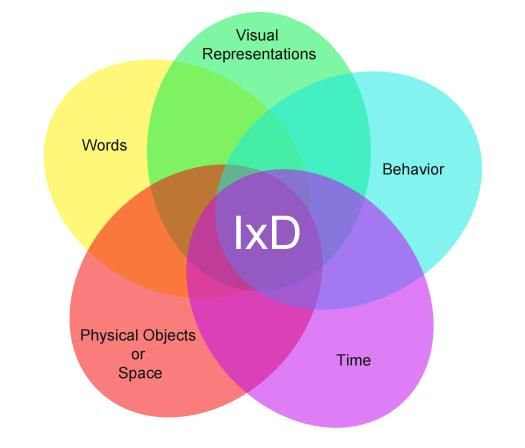
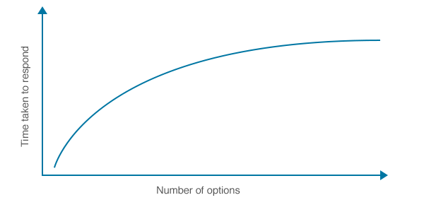
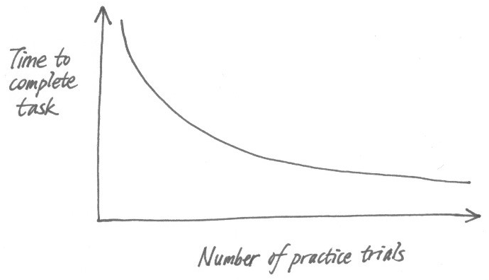
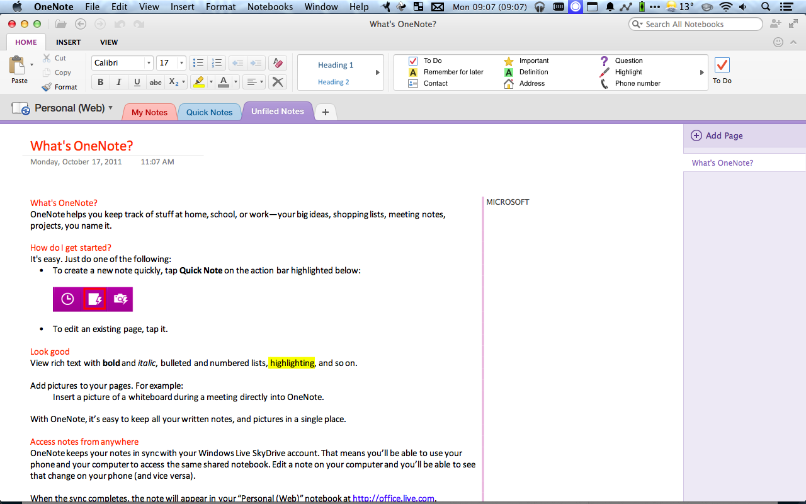

[.text: alignment(center)]

# Interaction Design

### CMPT 363

> “You only use what you understand.”  
— Steve Jobs

---

[.background-color: #618B25]

# _What is the practice of strategic **interaction design**?_

---

[.background-color: #FFFFFF]


---

[.background-color: #618B25]

# Topics to Explore

1. 5 Dimensions of IxD  
2. HCI Laws  

---

[.background-color: #611036]

# Interaction Design

### 5 Dimensions of IxD  

---

[.background-color: #FFFFFF]



---

[.background-color: #FFFFFF]


---

# 1D: Words

Includes all text visible to the user.

---

# 2D: Visual representations

Includes typography, imagery, icons, color palette, etc.

---

# 3D: Physical objects or space

Includes computer keyboards, mice, trackpads, and touchscreens that users interact with and the space they interact within.

---

# 4D: Time

Includes all interactive elements that change over time, such as motions, sounds, and animations.

---

# 5D: Behaviour

Includes how users react to an interaction - physically and emotionally.

---

[youtube]https://www.youtube.com/watch?v=KWtWqbJSP5E[/youtube]

---

[.background-color: #2d6e92]
[class=activity-link-color]

# Activity: 5 Dimensions of IxD

Assess the _5 dimensions of interaction_ of the SFU Library website, and if the website supports _natural conversations_ with its visitors

* 1D: Words
* 2D: Visual representations
* 3D: Physical objects or space  
* 4D: Time
* 5D: Behaviour

---

[.background-color: #611036]

# Interaction Design

### HCI Laws

---

# HCI Laws

* Miller's Law
* Hick's Law
* Power Law of Practice
* Fitts' Law

---

# Miller's Law

In 1956, George Miller published the paper "The Magical Number Seven, Plus or Minus Two: Some Limits on Our Capacity for Processing Information"

---

# Miller's Law

More recent research (Baddeley, 1986) indicates the capacity is closer to 3-4 items

---

# Miller's Law

The ability of working memory to store short-term information can be increased by "chunking" data

---


---

# Hick's Law

Hick's law estimates the time it takes for a person to make a choice as a result of the number of possible choices presented

---

# Hick's Law

T = b log2(n + 1)

b = empirically determined constant  
n = number of choices  

---

[.background-color: #FFFFFF]



---

[youtube]https://www.youtube.com/watch?v=pbbTOzArcWQ[/youtube]

---

# Power Law of Practice

Mathematically expresses that performing the same physical action over a period of time tends to increase performance

---

# Power Law of Practice

Tn = T1 n<sup>-a</sup> + c

T1 = first time to perform task, n is number of trails  
Tn = time to perform task after n times  
a = .4  
c = limiting constant  

---

[.background-color: #FFFFFF]



---

# Fitts' Law

Fitt’s law (1954) is a model of human movement

---

# Fitt's Law

T = k log2(D/S + 0.5), k ~ 100 msec.  

T = Time to move the hand to target  
D = distance between hand and target  
S = size of target  

---

[youtube]https://www.youtube.com/watch?v=M-9FbUJk6tI[/youtube]

---

[.background-color: #2d6e92]
[class=activity-link-color]

# Activity: Fitts' Law

Compare two variations of a user interface, based on the application of Fitts' Law

---


---



---


---


---

[.background-color: #618B25]

# Summary

1. 5 Dimensions of IxD  
2. HCI Laws  

---

[.background-color: #888888]

# References and Suggested Books

* Design for Emotion by Trevor van Gorp and Edie Adams
* Designing Interactions by Bill Moggridge
* A Web for Everyone: Designing Accessible User Experiences by Sarah Horton and Whitney Quesenbery
* Understanding WCAG 2.0, https://www.w3.org/TR/UNDERSTANDING-WCAG20/intro.html
* Designing User Interfaces for an Aging Population by Jeff Johnson and Kate Finn
* Emotional Design by Donald Norman

---

[.background-color: #888888]

# Image Credits

```
https://www.interaction-design.org/literature/article/the-five-languages-or-dimensions-of-interaction-design  
https://www.interaction-design.org/literature/article/what-is-interaction-design  
https://www.mozilla.org/en-US/firefox/  
https://products.office.com/en-ca/onenote/digital-note-taking-app  
https://optinmonster.com/11-web-design-principles-that-will-boost-your-conversion-rate/  
```
