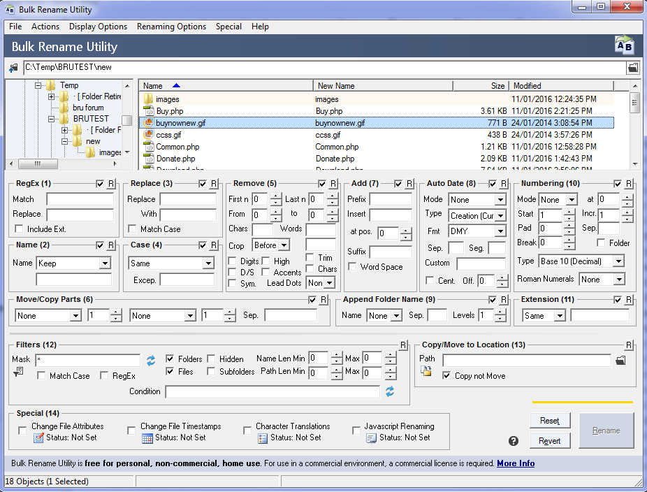
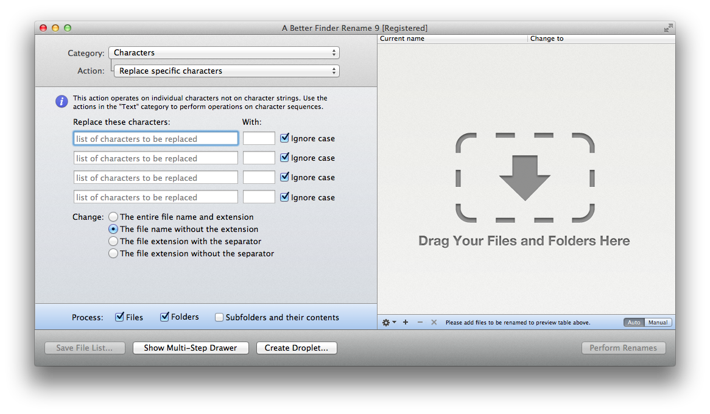

[.text: alignment(center)]

# Usability Testing

### CMPT 363

> “Use testing to guide design, not to grade designers.”  
— Jeff Johnson

---

[.background-color: #618B25]

# _How to plan, conduct, and summarize usability tests?_

---

[.background-color: #FFFFFF]


---

[.background-color: #618B25]

# Topics to Explore  

1. Testing Methods  
2. Conducting Tests  
3. Analysis and Reporting

---

[.background-color: #611036]
[.header: alignment(left),#FFFFFF]

# How to plan, conduct, and summarize usability tests?

### Testing Methods

---

# What is Usability Testing?

Simply put, having other people try to complete specific tasks with your product or service

---


---


---


---


---

# Types of Usability Testing

**Summative (verification)**  

Usability tests (often more formal) at the end of a development process or on a released product to assess if the interface meets pre-defined standards  
Quantitative measurements (stats) are often the focus

---

# Types of Usability Testing

**Formative (diagnostic)**  

Usability tests (often less formal) during the design process to help identify usability issues before development is finalized or a product is released  
Qualitative insights (details) are often the focus

---

# Why Conduct Usability Tests?

Learning opportunity for even the most experienced designers

---

# Why Conduct Usability Tests?

A very effective form of risk mitigation

---

# Why Conduct Usability Tests?

Insight into the critical “first-use” user experience

---

# Why Conduct Usability Tests?

Often the process of preparing for the test will result in discovering areas which can be improved

---

# Why Conduct Usability Tests?

All products and services will be usability tested once released!

---

# What are the Limitations of Usability Testing?

* Often done in artificial test environments (unless conducted remotely or on-location)
* Not really proof that the product works
* Participants are often not actual users
* Time-consuming and difficult to properly conduct extensive comparative tests
* Measures learnability rather than overall usability
* Not a replacement for interface design skills

---

# Usability Test Formats

* 5 second test  
* Paper and pencil
* Observational

---

# 5 Second Test

Show an image of a design to users for only 5 (five) seconds, and ask for their initial impressions

---

# Example 5 Second Test Questions

* What do you think is the primary purpose of this screen?
* What elements of the screen do you recall?
* Who do you think is the intended audience?
* What was your impression of overall design?

---




---



---

# Paper and Pencil (aka Sketches)

* Representative users are shown very early versions of interface design elements
* Users are then asked a series of task-oriented​ questions

---

# Example Task-oriented Questions

* What do you think is the primary purpose of this screen?
* What do you think about the overall organization of this screen?
* What might you do to start the task of …?

---

[.background-color: #2d6e92]
[class=activity-link-color]
[.header: alignment(left),#FFFFFF]
[.text: #FFFFFF]

# Activity: Task-oriented Questions

_Primary purpose of this screen?_  
_Overall organization of this screen?_  
_Start the task of …?_  

---


---

# Observational Test

A representative user is given one or more tasks to perform with the interface, and the evaluator passively observes

---

[youtube]https://www.youtube.com/watch?v=6DTSbey8ZyY[/youtube]

---

# Observational Test

If other colleagues are to be present, be sure to outline procedural expectations for the test

---
# Hawthorne Effect

A famous series of experiments were conducted in 1920’s and are often cited as proof that people being observed may try harder than usual to achieve their tasks

---
# Hawthorne Effect

This interpretation as applied to usability studies remains controversial, as the original study was longitudinal (same task over time) and participants were also task experts

---

# Time for Questions & Discussion

* What we’ve covered so far
 * What is usability testing?
 * 5-second test
 * Paper and pencil
 * Observational test
* Coming up
 * Conducting tests

---

[.background-color: #611036]
[.header: alignment(left),#FFFFFF]

# How to plan, conduct, and summarize usability tests?

### Conducting Tests

---

# Conducting Tests

* Pre-test activities
* Observational test activities
* Post-test activities

---

# Pre-Test Activities

* Define test purpose and concerns
* Identify test participants
* Create demographics (user profile) questionnaire
* Decide on test method
* Select tasks to be performed
* Create usability test tasks
* Conduct pilot test

---

# Define Test Purpose

When defining the purpose for a usability test, you are identifying the overall goal for the test

---

# Define Test Purpose

For example, “The purpose of this usability test is to get an early assessment of the overall usability of the software product XYZ”

---

# Define Test Concerns

When defining concerns for a usability test, you are identifying the specific aspects of the interface you want to learn more about

---

# Define Test Concerns

For example, “Can participants successfully submit an order form?” or “Do participants have any difficulty with terms and phrases?”

---

# Define Usability Targets  (Summative Tests)

Elements of a Usability Target:

- Condition {a}
- Criteria {b}
- Performance {c}

Example Usability Target (e.g. effectiveness):
With at least 3 months of Windows experience {a}, at least 80% of participants {b} should be able to complete the task of adding a new contact name {c}

---

# Key Usability Target Metrics

* Effectiveness (e.g. 80% of participants can complete the task without assistance)
* Efficiency (e.g. 70% of participants can complete the task in under 10 minutes)
* Attitude (e.g. after performing three tasks, 85% of participants rated their overall satisfaction with the software at least 5.5 out of 7)

---


---

# Identify Test Participants

If actual users are not available, the test participants chosen should be as representative of actual users as possible

---

# Sources for Test Participants

* Contacts via marketing or customer support
* Colleagues who are representative users
* Recent employees of your company
* “Dash and grab” company hallway method
* Anywhere you can find them (i.e. “Guerilla” usability testing)​

---

[youtube]https://www.youtube.com/watch?v=0YL0xoSmyZI[/youtube]

---

[.background-color: #FFFFFF]


---

# An Important Caveat

With 5 users you have an 85% chance of seeing the problem in an interface, but the probability is that it only affects 31% of users at least once.

Research has indicated that to be 85% sure you’ll see the problem that affects 10% of users at least once 18 users are required.

---

[.background-color: #FFFFFF]


---

# How Many Users, Really?

“Five users revealed most of the most common issues.”  
“Five users didn’t uncover most problems.”

_– Jeff Sauro, PhD, [Sample Size in Usability Studies: How Well doe the Math match Reality?](https://measuringu.com/sample-size-reality/)_

---

# User Demographics (User Profile) Questionnaire

A questionnaire should be used to collect and summarize demographic information about all the participants involved in the test

---

# Decide on Test Method

* Simple observation
* Think-aloud method

---

# Simple Observation Method

Most basic type of observational usability test  
Test participant is observed with as little interaction as possible

---

# Think-aloud Method

* A variation of the simple observational test, where participants are asked to think out loud (describe what they are thinking) while performing tasks  
* Most widely used method in the software industry

---

[youtube]https://www.youtube.com/watch?v=nJ2udLjdsx4[/youtube]

---

# Think-aloud Method

Method is not appropriate if the efficiency (i.e. time on task) is being measured, unless done in a retrospective manner

---

# Prompting Test Participants to Think-aloud

* What they believe is happening
* What they are trying to do
* Questions that arise in their mind
* Things that they find confusing
* Why they decided to try a specific action

---

[.text: #FFFFFF]

# Think-aloud Method

(+) Can reveal user’s mental model  
(+) Can be used early in design process  
(+) Precise pointers to problems  
(–) Unnatural situation  
(–) Measurement of time on task not reliable  
(–) Requires more participant effort  

---

# Co-discovery Method (Formative Tests)

Normal conversation between the two participants provides a more natural way of revealing internal thought processes

---

# Decide on Test Environment/Equipment

In-person vs. remote (via screen sharing software)  
Paper-based mockups vs. prototype vs. actual system  

---

[youtube]https://www.youtube.com/watch?v=V8LNDqMIapY[/youtube]

---

# Select Tasks to Perform

In general, either frequent tasks and/or important tasks should be selected for inclusion into usability tests

---

# Select Tasks to Perform

Ensure that a very simple task is at the beginning of the usability test

---

# Create Usability Test Tasks

* Tasks should start with a written scenario, describing one or more specific goals
* Communicate intent, but not the operations of what is required to be done
* Avoid using words contained in any user interface elements

---

# Example Usability Test Task

“You are planning to visit family on the east coast, but before you do so you need to temporarily stop your newspaper delivery”

“Cancel your Vancouver Sun newspaper delivery between Oct 10th to 29th.”

---

[.background-color: #2d6e92]
[class=activity-link-color]
[.header: alignment(left),#FFFFFF]
[.text: #FFFFFF]

# Activity: Usability Test Tasks

PROJECT GROUPS  
Create a possible usability test task (starting with a scenario) for users of your chosen open source/SFU community project

---

# Conduct Pilot Test

* Identifies issues with test materials (e.g. sequence, wording, etc.)
* Validates time estimates for tasks/session
* Ensures that the mock-up/software is capable of completing specified tasks

---

# Create a Usability Test Plan

* Test purpose
* Test concerns
* Usability targets (summative tests)
* Participant user profile
* Test method
* Test environment and equipment
* Test tasks
* Evaluation measurements

---


---

# Time for More Questions & Discussion

* What we’ve covered in this section
 * Defining test purpose and concerns
 * Identifying test participants
 * Creating user profile questionnaire
 * Deciding on test method
 * Selecting tasks to be performed
 * Creating usability test tasks
 * Conducting a pilot test
 * Usability test plan
* Coming up
 * Observational test activities

---

# Observational Test Activities

* Welcome participant
* Introduce the software
* Provide written tasks
* Observe participant
* Participant suggestions
* Test completion

---

# Welcome the Participant

Greet the participant, and provide a high-level overview of the software product being tested

---

# Welcome the Participant

Inform participants that the product’s user interface is being tested, and not them

---

# Welcome the Participant

Explain that you cannot provide help to the participant during the test, as this would bias the test results

---

# Welcome the Participant

Provide a signed consent form, if appropriate

---

# Welcome the Participant

* Other ethical considerations
 * Don’t use the term “test subject”
 * Test participants can end the test at any time
 * Results will remain anonymous (use a participant coding scheme)

---

# Introduce the Product

A brief preview or demonstration of the software product might be appropriate

---

# Introduce the Product

Be sure that none of the elements included in the usability test are demonstrated or discussed

---

[.background-color: #2d6e92]
[class=activity-link-color]
[.header: alignment(left),#FFFFFF]
[.text: #FFFFFF]

# Activity: Compare Two Usability Test Introductions

Moderating Usability Tests:
Principles and Practices for Interacting - Videos (Adobe Flash Required)

[Introductions](http://www1.us.elsevierhealth.com/books.elsevier/companionsites/morgankauffmann/Dumas/useability/introductions.html)  
[Pre-Test Script](http://www1.us.elsevierhealth.com/books.elsevier/companionsites/morgankauffmann/Dumas/useability/pretest_script.html)  
[Pre-Test No Script](http://www1.us.elsevierhealth.com/books.elsevier/companionsites/morgankauffmann/Dumas/useability/pretest_no_script.html)  
[Reactions Pretests](http://www1.us.elsevierhealth.com/books.elsevier/companionsites/morgankauffmann/Dumas/useability/reactions_pretests.html)

---

# Provide Written Tasks

Provide participants with a written copy of each task (one at a time) that you want them to try to perform

---

# Provide Written Tasks

Remember, these tasks should be written more as scenarios describing specific goals, and not operational instructions

---

# Observe the Participant

Carefully observe the participants as they try out your software, and have them indicate when they have completed each task

---

# Observe the Participant

Consider having another person on your team take notes of actions each participant tries to perform with the software

---

# Things to Watch Out For

* Inconsistencies between software and participants vocabulary
* Screens that participants visibly paused on
* The type and number of mistakes each participant makes

---

# How to Make Your Observations Effective?

Let participants make mistakes

---

# How to Make Your  Observations Effective?

Record, but do not answer, questions (alternative is to answer them with questions)

---

# How to Make Your  Observations Effective?

Do not tell participants what to do!

---

# How to Make Your Observations Effective?

Be careful not to give subtle cues, for example raising your voice often signals agreement

---

# How to Make Your Observations Effective?

Try not to be defensive, remember you are trying to create a better user experience!

---

# Handling Requests for Help

Reiterate in a very friendly manner that you cannot provide assistance, as doing so would bias the test results (note help requests)

---

# Handling Requests for Help

If your initial response is not sufficient,  state “Please remember, there’s no rush– take your time...”

---

# Handling Requests for Help

If assistance is provided, clearly indicate in your notes when and where participant received help

---

[.background-color: #2d6e92]
[class=activity-link-color]
[.header: alignment(left),#FFFFFF]
[.text: #FFFFFF]

# Activity: Moderating a Usability Test — Asking for Assistance

Moderating Usability Tests:
Principles and Practices for Interacting - Videos (Adobe Flash Required)

[Introductions](http://www1.us.elsevierhealth.com/books.elsevier/companionsites/morgankauffmann/Dumas/useability/introductions.html)  
[Usability test interactions sample](http://www1.us.elsevierhealth.com/books.elsevier/companionsites/morgankauffmann/Dumas/useability/interaction_2.html)  
[Usability test interactions reactions](http://www1.us.elsevierhealth.com/books.elsevier/companionsites/morgankauffmann/Dumas/useability/reactions_interaction_2.html)

---

# Participant Suggestions

Participants will often make specific suggestions regarding the usability issues that they encounter

---

# Participant Suggestions

These suggestions should be reviewed, but not blindly followed as solutions to problems

---

# Task Completion

* Once the test is complete, thank participants for their time and have them immediately fill out a post-test questionnaire before engaging in any follow-up discussions
* Provide participants with at least a token gift for their assistance

---

# Post-Test Questionnaire

* A small number of rating scales
* Features to add/remove or best/worst features of interface (open ended)
* Blank “other” or “comments” field
* Consider including questions on each task sheet/card
* Use existing questionnaire when possible (e.g. Single Ease Question after each task, System Usability Scale after all tasks)
* Single Ease of Use Question

---

# Single Ease of Use Question

* Overall, this task was?
 * Very difficult
 * Somewhat difficult
 * Neither difficult nor easy
 * Somewhat easy
 * Very easy

---

# Create a Usability Test Script For More Consistent Test Activities

* Introduction
* Session details, including participant rights
* Check if participant has any questions
* Pre-test survey/questions (if applicable)
* Usability test tasks
* Post-test survey/questions (if applicable)
* Session wrap-up, including thanking participant

---

# Time for More Questions & Discussion

* What we’ve covered in this section
 * Welcoming participant
 * Introducing the software
 * Providing written tasks
 * Observing participant
 * Participant suggestions
 * Test completion
* Coming up
 * Post-test activities

---

# Post-test Activities

Summarize and present the results to your team, and consider sharing them with all project stakeholders

---

# Post-test Activities

Ensure that there is time to use the results when conducting formative tests!

---

[.background-color: #611036]
[.header: alignment(left),#FFFFFF]
[.text: #FFFFFF]

# How to plan, conduct, and summarize usability tests?

### Analysis and Reportings

---

# Sharing Results - Brief Report

* Executive summary, including highlighting of positive attributes
* Methodology (participant profiles, test activities, and data collected)
* Key findings and recommendations

---

# Key Findings and Recommendations

* List of major issues
* Prioritized recommendations (if appropriate)
* Task success rate matrix
* User quotes
* Post-test questionnaire results

---

[.background-color: #FFFFFF]


---

# Task Success vs. Failure

* Success
 * Participant was able to complete task without using on-line help or requesting assistance
* Partial
 * Participant had to use on-line help, or had to try one or more actions before succeeding
* Failure
 * Participant required help from facilitator, or was unable to complete requested task

---

# Usability Test Report for  a Summative Test

Common Industry Format (ISO/IEC 25062:2006)  

* Title page
* Executive summary
* Introduction (full product description and objectives)
* Context of test (participants, tasks, environment, etc.)
* Experimental design (independent/dependent variables, measurements, procedure, general instructions, etc.)
* Results (data analysis, presentation of results , etc.)
* Appendices (detailed instructions, surveys, etc.)

---

[.background-color: #618B25]

# Summary

* Testing Methods  
 * Usability Testing Overview  
 * Usability Test Formats  
* Conducting Tests  
 * Pre-test Activities
 * Test Activities  
 * Post-test Activities  
* Analysis and Reporting
 * Sharing Test Results

---

[.background-color: #888888]
[.header: #FFFFFF, alignment(left)]

# References and Suggested Books

* Elements of User Interface Design, by Theo Mandel
* The Usability Kit, by Gerry  Gaffney and Daniel  Szuc
* Usability Engineering, by Jacob Nielsen
* How To Specify the Participant Group Size for Usability Studies: A Practitioner’s Guide, by Ritch Macefield
([uxpa.org/jus/article/how-specify-participant-group-size-usability-studies-practitioner’s-guide](https://uxpa.org/jus/article/how-specify-participant-group-size-usability-studies-practitioner%E2%80%99s-guide))

---

[.background-color: #888888]
[.header: #FFFFFF, alignment(left)]

# Image Credits (for images without source URL or note)

```
https://psmag.com/news/why-bad-ballot-design-is-a-really-significant-problem  
https://www.nngroup.com/articles/error-prevention/  
https://lib.calpoly.edu/news/2013/04/reinventing-the-library-website-student-sketches/  
https://measuringu.com/five-users/  
https://www.userfocus.co.uk/articles/usability_test_plan_dashboard.html  
https://uxdesign.cc/how-to-run-a-remote-usability-testing-4350c7786f20  
```
