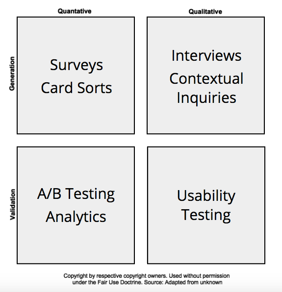

[.text: alignment(center)]

# User Research

### CMPT 363

> “We do not see things as they are, we see them as we are.”  
— Anaïs Nin

---

[.background-color: #618B25]

# _How to understand and communicate people’s needs and behaviors?_

---

[.background-color: #FFFFFF]


---

[.background-color: #618B25]
[.header: alignment(left),#FFFFFF]

# Topics to Explore  

1. Needsfinding
  * Interviews
  * Surveys
  * Contextual inquiries
2. User Models
  * Personas
  * Proto-personas
  * Empathy maps
3. Stories of Usage
  * Scenarios
  * User stories  
  * Jobs to be done  
  * Job stories  
  * Task prioritization

---

[.background-color: #FFFFFF]



---

# User Research

Pro Tip: Don't refer to user research as just "user research", but rather say "discovering user/customer problems"

---

# Before You Start Any User Research Efforts

* Identify the questions you are trying to answer (i.e. five Ws and one H):
 * Who?
 * What?
 * Where?
 * When?
 * Why?
 * How?

---

[.background-color: #FFFFFF]


---

[.background-color: #611036]
[.header: alignment(left),#FFFFFF]

# User Research

### Needsfinding

---

# Here’s (another) important interviewing tip: _Don't try to turn participants into designers_

---

# Types of Interviews

* Structured
* Unstructured
* Semi-structured (also called semi-directed)

---

# Structured

A pre-defined set of questions designed to produce shorter answers – often lacking opportunities for true insight

---

# Unstructured

No question script and more open-ended questions – can produce more insightful results

---

# Semi-structured

A core set of questions with ad-hoc questions for more details – insightful and more replicable

---

# Example Semi-structured Interview Questions

* What apps do you use daily? Can you describe the last time you used that app?
* Are these apps used at any specific times or days of the week? If yes, why at those times?
* What app do you find easiest to use?
* How did you learn to use that app? Oh I see, please tell me more about that…
* Why do you find that app easy to use?

---

# Things Not to Ask About

* What might be helpful in the future
* How feature “x” should be designed

---

# Interview Process

* Decide on what you want to learn
* Undertake appropriate level of domain research
* Decide which representative users to interview
* Consider ethical issues (e.g. consent, names, etc.)
* Decide information recording strategy
* Write interview outline, including intro, and conduct pilot-test
* Establish rapport and keep focus on participant
* Start interview with easy warm-up questions
* Present questions in a logical sequence
* Try to elicit stories and emotions  
* Be sure to thank participants for their time

---

[.background-color: #2d6e92]
[class=activity-link-color]
[.header: alignment(left),#FFFFFF]
[.text: #FFFFFF]

# Activity: Analyze Interview Video

---

[youtube]https://www.youtube.com/watch?v=SgUZbwT_lL8[/youtube]

---

[youtube]https://www.youtube.com/watch?v=KnBX0ShbYxQ[/youtube]

---

# Developing Interview Questions

* Avoid long questions
* Avoid compound sentences (i.e. > 1 question)
* Minimize hypothetical (e.g. would you?) questions
* Avoid unfamiliar terminology
* Avoid leading questions (e.g. why do you like…)
* Minimize use of yes/no type questions
* Start with easier What and When questions, then move onto Hows, and finally Whys

---

[.build-lists: true]

# Interview Tips

* Explain the purpose of the interview up-front
* Minimize yes/no type questions
* Focus on learning about their circumstances, motivations, experiences and feelings
* Get comfortable with silence
* Ask them to share stories and examples
* Watch out for described workarounds, difficulties, etc.
* Paraphrase to show you are listening and to confirm facts

---

# The Art of Listening

* Be comfortable with silence
* Give participants time to expand on initial thoughts, and ideally to start telling stories
* Provide visual or audio cues that you are focused
* Practice active listening (i.e. reflect back what is said)
* Do not offer your own opinions or thoughts

---

# The Power of Why

* By inquiring why a user does something in a particular way (or even a feature request!) is a very powerful technique to gain insight into user goals
* Why type questions can be seen as threatening sometimes, so try to formulate them in a less aggressive manner

---

# Keeping the Interview Going

* To keep the conversation going try
 * “Uh-huh”
 * “Yes, that’s very interesting”
 * “Oh yes, I see”
* To encourage continuation/show that you understand try
 * Paraphrase or repeat back
 * To get more details try
 * “Tell me more about…”
 * “And what did you do then?”
* To clarify try
 * “If I understand, your saying…”
* To change topics try
 * “Great, now let’s next talk about...”
 * “Let’s go back to something you mentioned earlier...”

---

# Interview Location

Ideally interviews should occur in the same environment that a person would be using the product in (e.g. workplace, home, etc.)

---

[.background-color: #2d6e92]
[class=activity-link-color]
[.header: alignment(left),#FFFFFF]
[.text: #FFFFFF]

# Activity: Interview Questions

PROJECT GROUP  
Write down 2-3 key questions that you might ask the primary user group of your chosen open source/SFU community project

---

# Surveys

Online surveys are a natural complement to interviews, and can be useful both before and after interviewing users.

---

# Surveys

Surveys are often best when a large sample size is needed for a number of simple questions (yes/no, multiple choice, item ranking, etc.)

---

# Tips for Creating Effective Surveys

* Keep the overall length of survey as brief as possible
* Maximize closed (i.e. pre-defined choices) questions and minimize open-type (i.e. free-form text fields) questions
* Order the questions in a natural/logical sequence
* The overall time for completing the survey should be < 5 mins.

---

# Time for Questions & Discussion

* What we’ve covered so far
 * User research methods
 * Types of interviews
 * Interview process
 * Developing interview questions
 * Interview tips
 * Creating surveys
* Coming up
 * Contextual Inquiries

---

# What is a Contextual Inquiry?

Observing people in their own environment perform their actual work with a product

---

# Why Perform a Contextual Inquiry?

* To learn who our are users
* To learn what are their tasks
* To learn what are their values, concerns, and issues

---

# Key Principles

* Context
* Partnership
* Interpretation
* Focus

---

# Possible Methods

* Work-based interview
* Post-observation
* Artifact walkthrough (most common approach)
* Performance-based focus group

---

# Inquiry Plan Outline

* Overall focus
* Specific concerns
* Participant demographics
* Inquiry method
* Inquiry schedule
* Pre-inquiry survey
* Inquiry script, including core interview questions

---

[.build-lists: true]

# Inquiry Script Outline

* Introduce yourself
* Restate focus of session
* Set session expectations
* Review confidentiality of information
* Get permission to record (if needed)
* Ask participant interview questions
* When appropriate, “transition” to CI (contextual inquiry) mode and ask participant to demonstrate tasks

---

# Example Interview Questions for a New Product

* Could you describe your current job/role?
* Can you describe a typical workday or week?
* What makes a good or bad workday?
* What activities do you most frequently perform?
* What activities are most important to complete?
* Are there any activities that you would like to change the workflow of? If so, why?
* Are there any activities you would like to reduce or eliminate? If so, why?

---

# Example Interview Questions for an Existing Product

* Could you describe your current job/role?
* Can you describe a typical workday or week?
* On average, how often do you use <product>?
* What are your main goals (reasons) for using <product>?
* What is your general opinion of <product>?  What are its strengths and weaknesses?
* What is an example of a key task that you use <product> for?
* How often do you perform that task? Please demonstrate
that task.

---

# Probing for More Information...

* Tell me a little more about...
* What are your thoughts about...
* Describe a bit more about...
* Share some more about...
* Talk some more about...
* Help me understand a little more about...

---

# Session Tips

* Perform your own domain research before the sessions
* Ensure to allocate enough time for each session, and between sessions
* If participant wants to vent, let them vent before session begins
* Be vigilant about observation being the majority of the session
* Whenever possible, ensure real tasks are being demonstrated, from start to finish

---

# Session Wrap-up

* Thank participants for their time
* Offer to answer any remaining questions that participants may have
* Would be appropriate to now share any tips and/or ask for their own possible solutions
* If appropriate, ask participants if follow-up contact is ok

---

# Post Session Activities

* Review session data as soon as possible
* Ensure all data/notes are traceable to individual participants
* Tag data with identifiers, such as themes
* Perform task analysis on observed workflows (i.e. flowchart)

---

[youtube]https://www.youtube.com/watch?v=mOWeNnSY5M0[/youtube]

---

[.build-lists: true]

# User Research Findings Analysis

* Review all collected data
* Tag any key data that still is not identified as such
* Consider construction of affinity diagram of all collected data
* Create user models and stories of usage from data
* Review tags and look for relationships, and tags similar to other tags (i.e. themes)
* Identify key insights (item learned, related tags, and supporting data)

---


# Time for Questions & Discussion

* What we’ve covered so far
 * Key principles of contextual inquiry
 * Possible methods
 * Inquiry plan and scripts
 * Interviewing long-time customers
 * Probing for more information  
 * Session tips
 * Session wrap-up
 * Post-session activities
 * User research findings analysis
* Coming up
 * User Models

---

[.background-color: #611036]
[.header: alignment(left),#FFFFFF]

# User Research

### User Models

---

# Personas

“A precise description of our user and what he or she wishes to accomplish.”  
– Alan Cooper

---


---

# Why Use Personas?

* Designing for everyone is really designing for no one
* Avoids the “elastic user”
* Communicates key user goals and needs
* Builds team consensus
* Improves design decision efficiency

---

# Example Elements for Personas

* Name
* Photo (when possible)
* Occupation
* Insightful quote (related to goals or pains)
* Personal background (i.e. characteristics, skills, knowledge, attitudes, expectations, behavior patterns, environment, interactions, etc.)
* Key goals
* Key actions/behaviours

---

# Proto-Persona

A persona based on our assumptions, but is viewed as a hypothesis to be iteratively validated and refined

---


---

# Elements of Proto-Persona

* Name/Image/Quote
* Demographics
* Behaviors (actions)
* Goals and Concerns

---

# Methods to Help Validate (or invalidate!) Proto-Personas

* Surveys
* Interviews
* Observations
* Domain experts
* Broader distribution
* Usability tests

---

# Empathy Map

An empathy map is a collaborative method to capture and summarize the desires and needs of your audience

---


---


---

# Think & Feel?

* What is important?
* What moves them?
* Things on their mind?
* Worries?
* Aspirations?

---

# See?

* What is their environment?
* Who are around them?
* What situations do they see?
* What are the similar products/systems?
* What problems do they see?

---

# Say and Do?

* What do they say?
* What are their attitudes (public and private)?
* What is their appearance?
* How do they behave?

---

# Hear?

* What do their friends say?
* Work colleagues?
* How about what influencers are saying?

---

# Pain?

* Frustrations?
* Fears?
* Obstacles?

---

# Goals?

* Wants and needs?
* How is success measured?
* Strategies for success?

---

<iframe src="https://player.vimeo.com/video/27832845" width="640" height="360" frameborder="0" allow="autoplay; fullscreen" allowfullscreen></iframe>

---

[.background-color: #2d6e92]
[class=activity-link-color]
[.header: alignment(left),#FFFFFF]
[.text: #FFFFFF]

# Activity: Personas and Empathy Maps

How do personas compare with empathy maps?

---

# Time for Questions & Discussion

* What we’ve covered so far
 * Empathy map overview
 * Map elements:  
  * Think and feel?
  * See?
  * Say and do?
  * Hear and do?
  * Pains
  * Goals
* Coming up
 * Stories of Usage

---

[.background-color: #611036]
[.header: alignment(left),#FFFFFF]

# User Research

### Stories of Usage

---

[youtube]https://www.youtube.com/watch?v=acMXhhdWylQ[/youtube]

---

# Ways to Represent Stories of Usage

* User Stories (as discussed earlier)
* Scenarios
* Jobs To Be Done
* Job Stories

---

# Scenarios

A description of people and their activities, including reaching their primary goal

---

# Example Scenario

“Emma, a sales manager, needs to arrange a meeting with her 5-member sales team to work out the details of an upcoming promotion. Using the meeting room booking system from her office computer she determines when they can all meet this week and reserves a room with a projector for the meeting.”

---

# User Stories

As a **role**,  
I want to **goal/desire**  
so that **benefit**

---

# Example User Stories
As a _Central Canadian Bank customer_,
I want to _withdrawal funds from an ATM_
so that _I have the cash I need on hand._

As a _Central Canadian Bank customer_,
I want to _transfer funds from one account to another_
so that _I have the funds to cover a large cheque_.

---

# Jobs To Be Done

A framework, or really a lens, to focus on customer motivations

---

# The JTBD Framework

Whatever product you are involved in, considering asking the question, what job is your product hired to do?

---


---

# Job Stories

A job story is an alternative to traditional user stories to collaborate and capture product requirements

---


---

[.background-color: #F7F6F3]


---

# Example Job Story vs User Story

When _I am running low on cash_
I want to _get access to some additional funds_
So I can _have the cash I need on hand._  

As a _Central Canadian Bank customer_,
I want to _withdrawal funds from an ATM_
so that _I have the cash I need on hand._

---

# Example Job Story vs User Story

When _I need more funds to cover an upcoming large cheque_
I want to _know ahead of time_
So I have _the funds to cover the cheque._

As a _Central Canadian Bank customer_,
I want to _transfer funds from one account to another_
so that _I have the funds to cover a large cheque_.

---

# Task/Story Prioritization

* Frequency
* Importance

---

[.background-color: #2d6e92]
[class=activity-link-color]

# Activity: JTBD

PROJECT GROUP  
Write down an 2-3 job stories for the primary user group of your chosen open source/SFU community project

When **situation**,  
I want to **motivation**  
So I can **expected outcome**

---

[.background-color: #618B25]

# Summary

* Needsfinding
 * Interviews
 * Surveys
 * Contextual Inquiries
* User models
 * Personas
 * Proto-personas
 * Empathy Maps
* Stories of Usage
 * Scenarios
 * User stories  
 * Jobs to be done  
 * Job stories  
 * Task prioritization

---

[.background-color: #888888]

# References and Suggested Books

* Contextual Design: Defining Customer-Centered Systems by Hugh Beyer and Karen Holtzblatt
* Interviewing Users by Steve Portigal
* Learning From Strangers: The Art and Method of Qualitative Interview Studies by Robert Weiss
* Observing the User Experience: A Practitioners Guide to User Research by Mike Kuniavsky
* Rapid Contextual Design: A How-to Guide to Key Techniques for User-Centered Design by Karen Holtzblatt, Jessamyn Burns Wendell and Shelley Wood
* User and Task Analysis for Interface Design by JoAnn Hackos and Janice Redish

---

[.background-color: #888888]

# References and Suggested Books

* About Face 3: The Essentials of Interaction Design by Alan Cooper, Robert Reimann and David Cronin
* Lean UX: Applying Lean Principles to Improve User Experience by Jeff Gothelf and Josh Seiden
* Observing the User Experience by Mike Kuniavsky
* The Essential Guide to User Interface Design by Walter Galitz
* The Inmates are Running the Asylum: Why High-Tech Products Drive Us Crazy and How to Restore the Sanity by Alan Cooper
* The Persona Lifecycle: Keeping People in Mind Throughout Product Design by Tamara Adlin and John Pruitt
* The Usability Engineering Lifecycle by Deborah Mayhew

---

[.background-color: #888888]

# Image Credits (for images without source URL or note)

```
https://www.uxtesting.io/blog/18/trust-in-ux-3-ways-of-exploratory-research  
http://www.webcredible.com/blog/personas-definitive-guide/  
http://www.cccc.org/news_blogs/john/2012/02/10/empathy-maps-a-way-to-understand-your-donors-and-beneficiaries/  
http://www.innovationlabs.org.uk/2014/04/25/empathy-maps/  
https://vivifychangecatalyst.wordpress.com/2017/09/23/clayton-christensen-milk-shakes-cigarettes-and-facebook/
https://www.intercom.com/blog/using-job-stories-design-features-ui-ux/  
```
