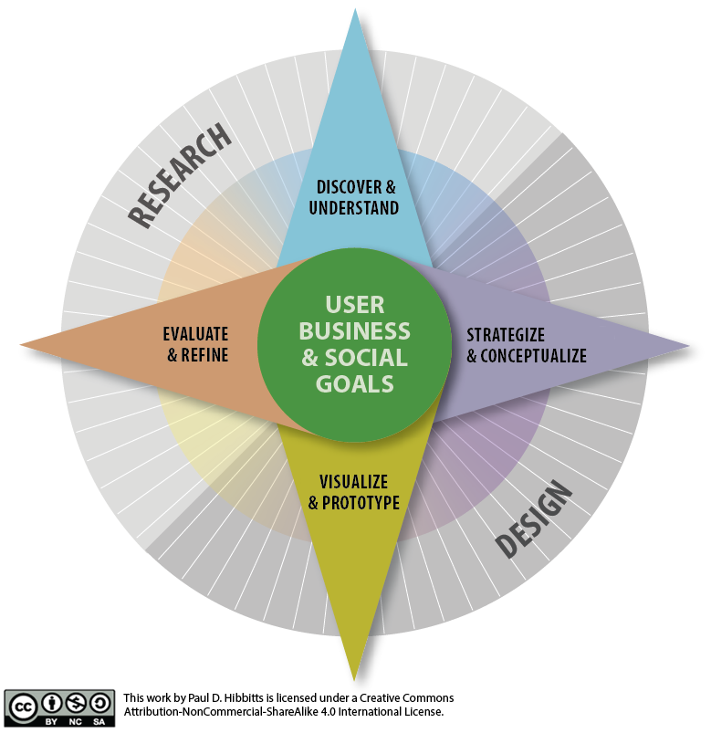

[.text: alignment(center)]

# Prototyping

### CMPT 363

> “If Ernest Hemingway, James Mitchener, Neil Simon, Frank Lloyd Wright, and Pablo Picasso could not get it right the first time, what makes you think that you will?”  
— Paul Heckel

---

[.background-color: #618B25]

# _How to explore and communicate possible design solutions?_

---

[.background-color: #FFFFFF]



---

[.background-color: #618B25]

# Topics to Explore

1. Forms and Methods  
2. Design Scenarios  
3. Sketching and Storyboarding

---

[.background-color: #611036]

# Prototyping

### Forms and Methods

---

# _What is a Prototype?_

---

# _What is a Prototype?_

A physical model of a particular design

---

# _What is a Prototype?_

A method of communication

---

# _What is a Prototype?_

A means of low-risk design exploration

---

# _What is a Prototype?_

A learning process!

---

# Why Prototype?

* Maintain focus on user
* Encourages exploration and reflection
* More easily understood than requirements
* User evaluation and feedback is possible

---


---

# Four Types of Prototypes

* Low-fidelity
* Mid-fidelity
* High-fidelity
* Super-fidelity

---


---


---


---

[youtube]https://www.youtube.com/watch?v=2b6PQpWH0lg[/youtube]

---

# Start with Why?

Before you choose a prototyping method, consider what you are trying to achieve by prototyping?

* Test
 * Usability testing designs (i.e. reducing risk)
* Engage
 * Engaging users
 * Engaging stakeholders
* Explore
 * Exploring possible designs
 * Exploring real content and data

---

# Example Interactive Prototyping Apps

* [Adobe XD](https://www.adobe.com/ca/products/xd.html)
* [Axure](https://www.axure.com/)
* [Figma](https://www.figma.com/)
* [Framer](https://framer.com/)
* [Invision](http://www.invisionapp.com/)
* [Justinmind](https://www.justinmind.com/)
* [Marvel](https://marvelapp.com/)
* [UXPin](https://www.uxpin.com/)

---

[youtube]https://www.youtube.com/watch?v=550do_N31FE[/youtube]

---

[youtube]https://www.youtube.com/watch?v=cmTfNUrvLnw[/youtube]

---


# Dimensions of Prototyping

* Vertical
* Horizontal

---


---

# Time for More Questions & Discussion

* What we’ve covered so far
 * What is a prototype?
 * Why prototype?
 * Types of prototypes
 * Dimensions of prototyping
* Coming up
 * Design Scenarios

---

[.background-color: #611036]

# Prototyping

### Design Scenarios

---

# What are Design Scenarios?

* Descriptions of people and their activities
* Series of events that results in reaching a goal
* Can be described textually or visually

---

# Example Design Scenario

“Emma, a sales manager, needs to arrange a meeting with her 5-member sales team to work out the details of an upcoming promotion. Using the meeting room booking system from her office computer she determines when they can all meet this week and reserves a room with a projector for the meeting.”

---

# Why Use Design Scenarios?

* Focus on (high-level) user goals
* Excellent way to share a vision (without requiring visuals)
* Highlights missing specifics early
* Provides a workflow-based viewpoint
* Establishes a shared understanding

---

[youtube]https://www.youtube.com/watch?v=EBl2qiADVJM[/youtube]

---

# Choosing Design Scenarios to Create

1. Create an inventory of user tasks (moderate granularity) for the system/product you will be creating
2. Determine frequency and importance for all tasks to help with scenario creation, prioritization and UI structure decisions

---

# How to Create Good Design Scenarios

* Describe what, not how
* Be very specific
* Describe reaching a user goal (or solving a problem)
* Include underlying motivation
* Describe who the user(s) are
* Include the context of use

---

[.background-color: #2d6e92]
[class=activity-link-color]

# Activity

How do Design Scenarios compare to User Stories?

---

# Describe What, Not How

“Emma, a sales manager, needs to arrange a meeting with her 5-member sales team to work out the details of an upcoming promotion. Using the meeting room booking system from her office computer she _determines when they can all meet this week_ and reserves a room with a projector for the meeting.”

---

# Be Very Specific

“Emma, a sales manager, needs to arrange a meeting with her _5-member sales team_ to work out the details of an upcoming promotion. Using the meeting room booking system from her office computer she determines when they can all meet _this week_ and _reserves a room with a projector_ for the meeting.”

---

# Describes Reaching a Goal

“Emma, a sales manager, _needs to arrange a meeting with her 5-member sales team_ to work out the details of an upcoming promotion. Using the meeting room booking system from her office computer she determines when they can all meet this week and reserves a room with a projector for the meeting.”

---

# Include Underlying Motivation

“Emma, a sales manager, needs to arrange a meeting with her 5-member sales team to _work out the details of an upcoming promotion_. Using the meeting room booking system from her office computer she determines when they can all meet this week and reserves a room with a projector for the meeting.”

---

# Describe Who the User(s) Are

“_Emma, a sales manager_, needs to arrange a meeting with her 5-member sales team to work out the details of an upcoming promotion. Using the meeting room booking system from her office computer she determines when they can all meet this week and reserves a room with a projector for the meeting.”

---

# Include the Context of Use

“Emma, a sales manager, needs to arrange a meeting with her 5-member sales team to work out the details of an upcoming promotion. _Using the meeting room booking system from her smartphone_ she determines when they can all meet this week and reserves a room with a projector for the meeting.”

---

# Tips About Creating Design Scenarios

Start with a brief goal-oriented scenario including trigger (motivation) or alternatively create a process flow diagram

---

# Tips About Creating Design Scenarios

Evaluate with real users whenever possible, to check for omissions, corrections, etc.

---

# Identify Potential Features

Once design scenarios have been created, review them to start identifying potential features of the system

---

# Good Design Scenarios

✓ Describe what, not how  
✓ Be very specific  
✓ Describe reaching a user goal (or solving a problem)  
✓ Include underlying motivation  
✓ Describe who the user(s) are  
✓ Include the context of use  

---

[.background-color: #2d6e92]
[class=activity-link-color]
[.header: alignment(left),#FFFFFF]
[.text: #FFFFFF]

# Activity: Write a Design Scenario

PROJECT GROUP  
Write a scenario for a person using your chosen open source/SFU community project

❑ Describe what, not how  
❑ Be very specific  
❑ Describe reaching a user goal (or solving a problem)  
❑ Include underlying motivation  
❑ Describe who the user(s) are  
❑ Include the context of use

“Emma, a sales manager, needs to arrange a meeting with her 5-member sales team to work out the details of an upcoming promotion. Using the meeting room booking system from her office computer she determines when they can all meet this week and reserves a room with a projector for the meeting.”

---

# Time for More Questions & Discussion

* What we’ve covered so far
 * Design Scenarios
* Coming up
 * Sketching

---

[.background-color: #611036]

# Prototyping

### Sketching and Storyboarding

---

[youtube]https://www.youtube.com/watch?v=JMjozqJS44M[/youtube]

---

# Sketching

* Critical during the early phase of design
* Must be quick, cheap, and disposable
* Focus on design concepts rather than details (intended roughness)
* Cross-team contribution possible and valuable

---

# Sketching vs. Wireframes

---


---

[.background-color: #FFFFFF]


---

# Sketching with Paper

* Fine black Sharpie (start with this)
* Medium black Sharpie (to add emphasis)
* Thick grey marker (to add depth)
* Yellow highlighter (to bring attention)

---


---

# Sketching Tips

* We can all draw adequately to sketch!
* Think of sketching simply as a means to communicate ideas
* Strive to explore an idea from multiple perspectives, not just one sketch per idea
* Consider the element of task-flow (narrative)
* Freely combine words and drawings

---

# Divergent Sketching

Use sketches to quickly explore a range of divergent designs for key screens or concepts

---


---

# Sketching for Requirements

With the quick and disposable nature of sketches, they are also an effective tool to help identify requirements with users (and existing assumptions)

---


---


---


---


---


---

# A Few Drawing Tips

* Choose a thicker marker to sketch with
* Start with a base using a light grey marker
* Draw corners with two intersecting lines
* Use shadows to add depth or highlight items
* Practice, practice, practice!

---

[.background-color: #FFFFFF]


---

[.background-color: #2d6e92]
[class=activity-link-color]

# Activity: Sketching

PROJECT GROUP  

1. Individually, create a quick sketch of a possible future design that represents the starting point (screen) of your previously written scenario
2. Share your sketch and discuss the similar and/or different design ideas that are represented

---

# Sketching Storyboards

* A sequence of drawings representing a specific period of time
* Can illustrate various levels of detail (fidelity)

---


---

# Effective Storyboards

* Initially black and white
* Simple shapes and text blocks
* Unique name/number for each page
* Segment storyboards by user tasks
* Must be able to speak for themselves

---

# Design Scenario Storyboards

* Visually represents a user's main success path within a design scenario
* Each step has a one sentence description of the required user action

---


---

# Pre-test User Feedback

You can share the storyboards with potential users before conducting usability tests and ask questions such as what they like/dislike (with follow-up questions), is anything missing, and could you see yourself in the story shown?

---

# Example Sketching Apps

* [Balsamiq](https://www.balsamiq.com/)
* and ???

---


---

[youtube]https://www.youtube.com/watch?v=l_jJMMY_QMQ[/youtube]

---

[.background-color: #618B25]

# Summary

* Forms and Methods  
* Design Scenarios  
* Sketching and Storyboarding

---

[.background-color: #888888]

# Image Credits  (for images without source URL or note)

```
https://revisionlab.wordpress.com/that-squiggle-of-the-design-process/
https://medium.com/fold-line-gold/four-common-types-of-software-prototypes-8fa275c0602f
https://www.umsl.edu/~sauterv/analysis/Fall2013Papers/Boutaugh/elementspage.html
https://www.leemunroe.com/designing-with-pen-paper/
https://www.smashingmagazine.com/2013/06/sketching-for-better-mobile-experiences/
http://ferhatsen.com/design-fest.html
https://msdn.microsoft.com/en-us/library/windows/desktop/ff800706.aspx
http://sneakpeekit.com/
https://blog.rangle.io/master-ui-wireframes-with-only-three-shapes/
http://uxmovement.com/wireframes/why-its-important-to-sketch-before-you-wireframe/
http://johnnyholland.org/2011/10/storyboarding-ux-part-2-creating-your-own/
https://noelbyrne.wordpress.com/2010/01/16/balsamiq-mockups/
```
