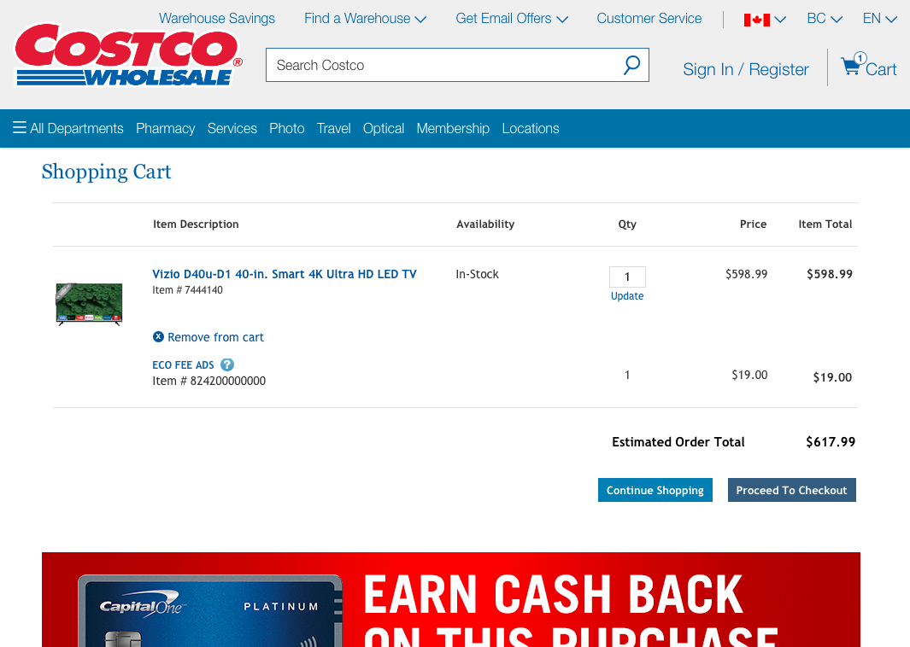
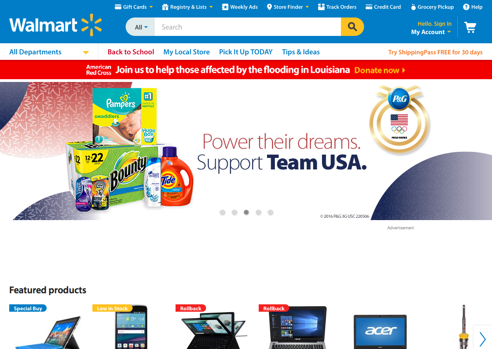

[.text: alignment(center)]

# User Interface Inspections

### CMPT 363

> “As soon as we started programming, we found to our surprise that it wasn’t as easy to get programs right as we had thought. Debugging had to be discovered. I can remember the exact instant when I realized that a large part of my life from then on was going to be spent in finding mistakes in my own programs.”  
— Maurice Wilkes (1949)

---

[.background-color: #618B25]

# _How to conduct a usability inspection?_

---

[.background-color: #FFFFFF]


---

[.background-color: #618B25]

# Topics to Explore

1. Cognitive Walkthroughs  
2. Conducting Heuristic Evaluations  
3. Nielsen’s Heuristics

---

# Types of Inspections

* Cognitive walkthroughs
* Heuristic evaluations

---

[.background-color: #611036]

# How to conduct a usability inspection?

### Cognitive Walkthroughs

---

# Cognitive Walkthroughs
A cognitive walkthrough is a task-based evaluation method to catch “black holes” (gaps in determining the next appropriate step)

---

# Cognitive Walkthroughs

* Define the user(s)
* Select/create a collection of tasks
* Define the correct sequence for each task
* Proceed step-by-step through the interface (or mockups),
asking the following questions from the user’s perspective…

---

[.build-lists: true]

# Standard Cognitive Walkthrough Questions

* Will the user try to achieve the right effect?
* Will the user notice that the correct action is available?
* Will the user associate the correct action with the effect that the user is trying to achieve?
* If the correct action is performed, will the user see that progress is being made toward the solution of the task?

---

[.build-lists: true]

# Cognitive Walkthrough Answers

* “Likely” - a credible success story should be able to be stated
* “Unlikely” - a credible failure story should be able to be stated
* “Not clear” - a credible reason should be able to be stated

---

[youtube]https://www.youtube.com/watch?v=Edqjao4mmxM[/youtube]

---

# Streamlined Cognitive Walkthrough Questions

* Will the user know what to do at this step?
 * Consider the user’s goal and what they may thinking about (intent)
 * Consider the visibility of required interface elements and clarity of labels and prompts (visibility and identification)

---

# Streamlined Cognitive Walkthrough Questions

* If the user does the right thing, will they know that they did the right thing, and are making progress towards their goal?
* Consider if adequate and informative feedback is supplied (progress)

---

[.background-color: #FFFFFF]


---

# Streamlined Cognitive Walkthrough Ground Rules

* All identified issues will be noted
* No design discussions allowed!

---

[.background-color: #2d6e92]
[class=activity-link-color]

[.text: #FFFFFF]

# Activity: Cognitive Walkthrough

Task: What are the hours of the main campus Library this Saturday?

_Cognitive walkthrough questions:_  
Will the user know what to do at this step?  
If the user does the right thing, will they know that they did the right thing, and are making progress towards their goal?

---

[.background-color: #611036]

[.text: #FFFFFF]

# How to conduct a usability inspection?

### Conducting Heuristic Evaluations

---

# Heuristic Evaluations

The evaluation of a user interface to a checklist of design rules or heuristics

---

# Heuristic Evaluations

A heuristic evaluation can quickly and effectively reveal key user interface issues

---

# Heuristic Evaluations

In 1990 Jakob Nielsen (SUN Microcomputers, now Nielsen-Norman Group) and Rolf Molich developed the first list of usability heuristics

---

# Heuristic Evaluations

This list was later revised (1994) by Nielsen into somewhat more abstract items based on analysis of 249 usability problems

---

# Nielsen’s Heuristics (1994)

* Visibility of system status
* Match between system and the real world
* User control and freedom
* Consistency and standards graphics, layout
* Error prevention
* Recognition rather than recall
* Flexibility and efficiency of use
* Aesthetic and minimalist design
* Help users recognize, diagnose and recover from errors
* Help and documentation

---

# Alternative Lists of Heuristics

* Gary Perlman’s Practical Usability Heuristics (1997)
* Jill Gerhardt-Powals’ Cognitive Engineering Principles for Enhancing Human-Computer Performance (1996)
* ISO 9241 “dialogue principles” (2006)

---

# ISO 9241 Dialogue Principles

* Suitability for the task
* Self-descriptiveness
* Conformity with user expectations
* Suitability for learning
* Controllability
* Error tolerance
* Suitability for individualization

---

# So, Which List to Use?

It really depends on your specific needs, but overall I prefer the ISO-9241 for pure evaluations, but Nielsen’s list for evaluations and use as general design principles

---

[.build-lists: true]

# Heuristic Evaluation Overview

1. Select heuristics list
2. Have evaluators go through UI (twice is recommended)
3. Combine findings on one list
4. Have evaluators independently rate severity
5. Present findings to design team, first highlighting positive aspects of the user interface

---

[.background-color: #FFFFFF]


---

[.background-color: #FFFFFF]


---

# Task-based Heuristic Evaluation

A viable alternative to a standard heuristic evaluation, which is also more supportive for a single expert evaluator, is a task-based inspection

---

# Assessing Usability Problem Severity

Strategy

* Frequency
* Impact
* Persistence

---

# Frequency

The frequency with which the problem occurs: Is it common or rare?

---

# Impact

The impact of the problem if it occurs: Will it be easy or difficult for the users to overcome?

---

# Persistence

The persistence of the problem: Is it a one-time problem that users can overcome once they know about it or will users repeatedly be bothered by the problem?

---

[.build-lists: true]

# Example Severity Rating

[0] Disagree about usability problem  - don’t agree that this is a usability problem at all  

[1] Cosmetic Only - need not be fixed unless extra time is available on project

[2] Minor usability problem  - fixing this is a low priority  

[3] Major usability problem  - important to fix, so should be given high priority  

[4] Usability catastrophe (“Critical usability issue”) - imperative to fix this before product can be released

---

# Heuristic Evaluation

(+) Reasonably cheap and fast  
(+) Can be used at any time in design process  
(+) Identifies many usability problems  

---

# Heuristic Evaluation
(–) More effective with fully defined designs  
(–) Can over-emphasize minor problems  
(–) Does not identify task-based problems (using standard approach)  
(–) Does not identify domain-related problems  

---

# Time for Questions & Discussion

* What we’ve covered so far
 * What is a cognitive walkthrough
 * Cognitive walkthrough questions
 * What is a heuristic evaluation
 * Usability heuristic lists
 * Heuristic evaluation overview
 * Severity ratings
 * Advantages and disadvantages
* Coming up
 * Applying Jakob Nielsen’s heuristics

---

[.background-color: #611036]

# How to conduct a usability inspection?

### Nielsen’s Heuristics

---

# 1. Visibility of System Status

The system should always keep users informed about what is going on, through appropriate feedback within reasonable time.

---


---


---


---


---


---


---


---


---


---


---

# _What about response time in action/response situations?_

---

# Defining “Within Reasonable Time”

* Specific guidelines for response times are:
 * 0.1 second for perceived instantaneous response
 * 1.0 second for task flow not to be interrupted (user will notice delay however)
 * 10 seconds is about the maximum for a user to be able to keep focus on current task

---

# 2. Match Between System and the Real World

The system should speak the user’s language, with words, phrases and concepts familiar to the user, rather than system-oriented terms.

---

# 2. Match Between System and the Real World

Follow real-world conventions, making information appear in a natural and logical order.

---


---


---


---


---

# 3. User Control and Freedom

Users often choose system functions by mistake and will need a clearly marked “emergency exit” to leave the unwanted state without having to go through an extended dialogue.

---


---


---


---


---

# 3. User Control and Freedom

Support undo and redo.

---



---


---


---


---

# 4. Consistency and Standards

Users should not have to wonder whether different words, situations, or actions mean the same thing.

---

# 4. Consistency and Standards

Follow platform conventions

---


---


---



---


---

# 5. Error Prevention

Even better than good error messages is a careful design which prevents a problem from occurring in the first place.

---


---


---

# Time for Questions & Discussion

* What we’ve covered so far
 * Visibility of system status
 * Match between system and the real world
 * User control and freedom
 * Consistency and standards graphics, layout
 * Error prevention
* Coming up
 * Recognition rather than recall

---

# 6. Recognition Rather than Recall

Make objects, actions, and options visible. The user should not have to remember information from one part of the dialogue to another.

---

# 6. Recognition Rather than Recall

Instructions for use of the system should be visible or easily retrievable whenever appropriate .

---


---


---


---


---

# _How about another example of reducing memory load during a longer task?_

---


---


---


---


---


---


---


---


---


---


---

# _Now, let’s look at another Costco vs. Walmart example of reducing memory load..._

---


---


---


---


---

# 7. Flexibility and Efficiency of Use

Accelerators - unseen by the novice user - may often speed up the interaction for the expert user such that the system can cater to both inexperienced and experienced users.

---

# 7. Flexibility and Efficiency of Use

Allow users to tailor frequent actions.

---


---


---


---


---


---

# 8. Aesthetic and Minimalist Design

Dialogues should not contain information which is irrelevant or rarely needed.

---

# 8. Aesthetic and Minimalist Design

Every extra unit of information in a dialogue competes with the relevant units of information and diminishes their relative visibility.

---


---


---


---


---

# 9. Help Users Recognize, Diagnose and Recover From Errors

Error messages should be expressed in plain language (no codes), precisely indicate the problem, and constructively suggest a solution.

---


---


---


---


---

# 10. Help and Documentation

Even though it is better if the system can be used without documentation, it may be necessary to provide help and documentation.

---

# 10. Help and Documentation

Any such information should be easy to search, focused to the user’s task, list concrete steps to be carried out, and not be too large.

---


---


---


---


---


---


---


---

# Nielsen’s Heuristics

* Visibility of system status
* Match between system and the real world
* User control and freedom
* Consistency and standards graphics, layout
* Error prevention
* Recognition rather than recall
* Flexibility and efficiency of use
* Aesthetic and minimalist design
* Help users recognize, diagnose and recover from errors
* Help and documentation

---

[.background-color: #618B25]

# Summary

* Cognitive Walkthroughs
* Conducting Heuristic Evaluations  
* Nielsen’s Heuristics

---

[.background-color: #888888]
[.header: #FFFFFF, alignment(left)]

# References and Suggested Books

* The Streamlined Cognitive Walkthrough Method, CHI 2000 Proceedings by Rick Spencer
* Usability Engineering, by Jacob Nielsen
* Usability Inspection Methods, by Jacob Nielsen and Robert Mack

---

[.background-color: #888888]
[.header: #FFFFFF, alignment(left)]

# Image Credits (for images without source URL or note)a

```
https://chatbotsmagazine.com/usability-heuristics-for-bots-7075132d2c92  
https://foundationsofhci.wordpress.com/module-2/  
https://www.nngroup.com/articles/how-to-conduct-a-heuristic-evaluation/
http://www.measuringu.com/blog/effective-he.php  
```
