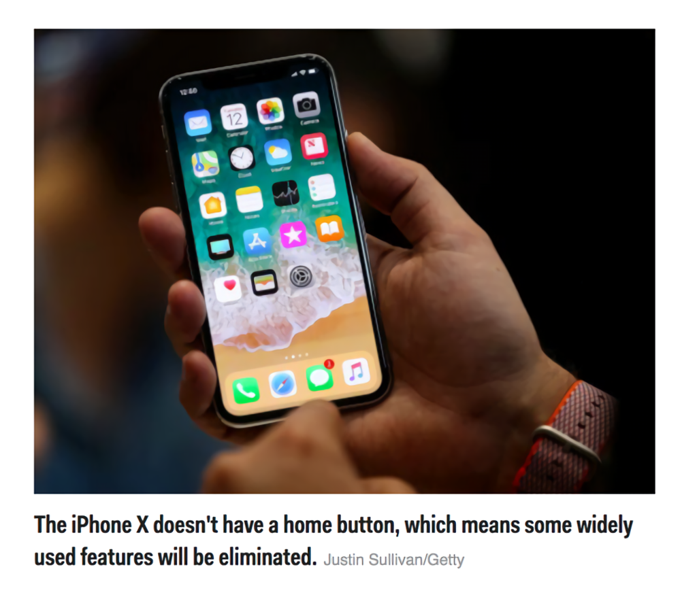

[.text: alignment(center)]

# Mobile and Multi-device Design

### CMPT 363

> “Mobile is not the future, it is the now. Meet your customers in the environment of their choice, not where it is convenient for you.”  
— Cyndie Shaffstall

---

[.background-color: #618B25]

# _How to design for mobile and multi-device usage?_

---

[.background-color: #FFFFFF]


---

[.background-color: #FFFFFF]


---

[.background-color: #618B25]

# Topics to Explore

1. “Mobile” Design
2. Touch Interaction Design
3. Responsive Web Design (RWD)

---

[.background-color: #611036]
[.header: alignment(left),#FFFFFF]

# Mobile and Multi-device Design

### “Mobile” Design

---


---


---


---


---

[.background-color: #2d6e92]
[class=activity-link-color]
[.header: alignment(left),#FFFFFF]
[.text: #FFFFFF]

# Activity: Defining Mobile

What does the term  “Mobile”  mean in 2018?

---


---


---


---

# False Mobile Assumptions

* Being mobile means being in a rush
* Mobile searches are mostly done on-the-go
* Mobile users are ok with having less
* Context is king (instead think about intent)

---


---

# _So, we need to think more about multi-device, and not just mobile_

---

[youtube]https://www.youtube.com/watch?v=WMklcdzcNcU[/youtube]

---

[.text: alignment(center),#FFFFFF]

[youtube]https://www.youtube.com/watch?v=oxqH0XDCciY[/youtube]

---


---

# Mobile First

* Mobile First, as defined by Luke Wroblewski in 2009
* Adoption (larger audience for mobile)
* Focus (content and functionality constraints)
* Technologies (touch, geolocation, etc.)

---


---


---

# Mobile First, To Me

* When  the element of mobility is a core value proposition
* Even given that, I prefer the battle cry of Experience First (HT @kevinmpowell) these days... why?
 * Mobile usage (i.e. “on the go”) is context guessing at best
 * No longer a singular mobile device, but a family of devices
 * Since mobile to me is device independent – I define it as  “being close at hand” or “being available”
 * People deserve content/function parity everywhere
 * The best experience should always be leveraged, not constrained, by device attributes

---

[.background-color: #FFFFFF]


---

[.background-color: #FFFFFF]


---

[.background-color: #FFFFFF]


---

[.background-color: #FFFFFF]


---

[.background-color: #FFFFFF]


---

[.background-color: #FFFFFF]


---

[.background-color: #545454]


---

# Multi-device Experience Goals

* Conceptual and visual consistency
* Content and functionality parity
* Seamless task transferability
* Think ecosystem, not isolated devices
* Optimize physical interactions on every device

---

# Google Mobile Design Principles

* Home page and site navigation (1 of 5 categories)
 * Keep calls to action front and center
 * Keep menus short and sweet
 * Make it easy to get back to the home page
 * Don’t let promotions steal the show

[developers.google.com/web/fundamentals/design-and-ux/principles/](https://developers.google.com/web/fundamentals/design-and-ux/principles/)

---

# iOS Mobile Design Principles

* Aesthetic Integrity
* Consistency
* Direct Manipulation
* Feedback
* Metaphors
* User Control

[iOS Design Principles](https://developer.apple.com/ios/human-interface-guidelines/overview/themes/)

---

# _What is common between these two sets of mobile design principles?_

---

# Time for Questions & Discussion

* What we’ve covered so far
 * Mobile usage statistics
 * Expect touchscreens everywhere
 * Do not context guess with “mobile assumptions”
 * Experience first vs. mobile first
 * It is a multi-screen world
 * Mobile design principles
* Coming up
 * Touch interaction design

---

[.background-color: #611036]

# Mobile and Multi-device Design

### Touch Interaction Design

---


---


---


---

[youtube]https://www.youtube.com/watch?v=O99m7lebirE[/youtube]

---

[youtube]https://www.youtube.com/watch?v=r3CTKI6pRlQ[/youtube]

---

[.background-color: #FFFFFF]


---

[.background-color: #FFFFFF]


---

[.background-color: #FFFFFF]



---

[.background-color: #2d6e92]
[.header: alignment(left),#FFFFFF]
[.text: #FFFFFF]

# Activity: Small Screen Navigation Case Study

Let’s take a look at a website's level of 'thumb friendliness' on a mobile device...

---


---


---


---

[youtube]https://www.youtube.com/watch?v=jm16qmCXmoY[/youtube]

---

# Essential Touch Interaction Design Guidelines

* Touch Target Size
* Placement of Controls
* Behavior (i.e. no hovers)
* User Effort
* Gestures (i.e. standard and non-standard)

---

# Activity: Touch Interaction Analysis

[.background-color: #2d6e92]
[.header: alignment(left),#FFFFFF]
[.text: #FFFFFF]

PROJECT GROUP  

[One-Page Touch Interaction Design Checklist](https://canvas.sfu.ca/courses/38847/files/folder/Handouts/Touch%20Interaction%20Checklist)

Assess touch interaction of your chosen open source/SFU community project

---

[.background-color: #FFFFFF]


---

[.background-color: #FFFFFF]


---

[.background-color: #611036]

# Mobile and Multi-device Design

### Responsive Web Design (RWD)

---


---

# Responsive Web Design (RWD)

* Content/interface universal for all devices
* One source of content, presented differently
* Key elements
 * CSS media queries
 * Fluid grid layouts
 * Flexible images and media

---


---

# Intrinsic Web Design (a future successor to RWD?)

Use of Flexbox, Grid, and Box alignment for much more fine-grained control of placement

---

# Intrinsic Web Design

* Fluid & fixed
* Stages of squishiness
* Rows & columms
* Nested contexts
* Ways expand & contract
* Media queries,as needed

---

<p class="codepen" data-height="265" data-theme-id="0" data-default-tab="html,result" data-user="huijing" data-slug-hash="yQrRgL" style="height: 265px; box-sizing: border-box; display: flex; align-items: center; justify-content: center; border: 2px solid; margin: 1em 0; padding: 1em;" data-pen-title="Rate of change of size">
  <span>See the Pen <a href="https://codepen.io/huijing/pen/yQrRgL/">
  Rate of change of size</a> by Chen Hui Jing (<a href="https://codepen.io/huijing">@huijing</a>)
  on <a href="https://codepen.io">CodePen</a>.</span>
</p>
<script async src="https://static.codepen.io/assets/embed/ei.js"></script>

---

# My RWD Design Process

* Discover (always lots to learn...)
* List and prioritize the content (nothing fancy)
* Development
 * Sketch (content placeholders, mostly for breakpoints)
 * Wireframe (a teeny bit really, sometimes none)
 * Visual Design (rough layout colour comps, maybe)
 * Prototype (a whole lot, and then some more!)
 * Test (rinse and repeat as needed)
* Deliver

---

[.header: #FFFFFF, alignment(center)]

# Responsive Web Design Sketch Sheets


<http://jeremypalford.com/arch-journal/responsive-web-design-sketch-sheets/>

---

# Content Inventories

* A standard IA technique - even more essential for RWD
* Inventory a first step, but prioritization is the key
* Plays a key role when deciding upon RWD breakpoints

---

# Typical Content Inventory Structure

* Content
* Type
* Location
* Meta-data
* Owner
* Last updated
* Comments

---

# RWD Content Inventory Adjustments

* Content
* _Priority_
* Type
* _Size (characters, image dpi/dimensions, etc.)_
* Location
* Meta-data
* Content owner
* Last updated
* Comments

---

[.background-color: #2d6e92]

# Activity: Content Inventory

PROJECT GROUP

Review your chosen open source/SFU community project and start to create a content inventory to estimate considered priority per placement

Content  
Type  
Size
Location  
_Indicated Priority_

---

# Prototyping Using a HTML Framework

* Generate smartphone, tablet, and desktop mockups
* Single source of content for all device presentations
* Supports a fast, highly iterative, design-feedback loop
* Focus first on creating the right thing, then focus on right look
* May be possible to seamlessly move from prototype to website
* Use a Responsive HTML Framework for Prototyping

---

# Use a Responsive HTML Framework for Prototyping

* Twitter Bootstrap
* Zurb Foundation
* Material Design Lite (Google)

---

# Twitter Bootstrap HTML Examples

Two Column Grid

```
<div class="row">
  <div class="span9">...</div>
  <div class="span3">...</div>
</div>
```

Information Alert Box

```
<div class="alert alert-info"> ... </div>
```

---

# Twitter Bootstrap Resources

* Twitter Bootstrap
 * http://getbootstrap.com/
* Ppingendo - The ultimate Bootstrap 4 builder
 * https://pingendo.com/
* Twitter Bootstrap Tutorials
 * https://www.lynda.com/Bootstrap-training-tutorials/1421-0.html

---

# _Caveat: Standalone HTML Prototypes May Hinder Collaborative Design_

---

[youtube]https://www.youtube.com/watch?v=BKvg8_8jv10[/youtube]

---

[.background-color: #618B25]

# Summary

* “Mobile” Design
* Touch Interaction Design
* Responsive Web Design (RWD)

---

[.background-color: #888888]

# References and Suggested Books

* Designing for Touch by Josh Clark

---

[.background-color: #888888]

# Image Credits (for images without source URL or note)

```
http://uselog.blogspot.com/2005/10/user-centered-design-immerse-yourself.html
http://www.tune.com/blog/mobile-tipping-point-16-predictions-for-2016/
http://www.business2community.com/mobile-apps/dont-underestimate-importance-mobile-marketing-01422609#5ODb5qx2LhZqwjwD.97  
https://www.stonetemple.com/mobile-vs-desktop-usage-study/  
https://medium.com/swlh/browsers-not-apps-are-the-future-of-mobile-c552752ff75
https://twitter.com/derekakessler/status/322342508912852992
https://wearesocial.com/blog/2018/01/global-digital-report-2018  
http://communities-dominate.blogs.com/  
https://www.asus.com/sa-en/Laptops/asus_vivobook_s551lb/
https://abookapart.com/products/mobile-first
http://bradfrost.com/blog/web/responsive-web-design-missing-the-point/
https://appsamurai.com/mobile-web-vs-mobile-in-app-advertising-which-is-better/
https://digitalstyle.com/blog/design/responsive-web-design-company/
https://www.thinkwithgoogle.com/advertising-channels/mobile/the-new-multi-screen-world-study/
http://bgr.com/2013/06/17/samsung-galaxy-devices-chart/
https://www.gizmodo.com.au/2014/09/how-to-design-for-thumbs-in-the-era-of-huge-screens/
http://www.businessinsider.com/apple-iphone-x-reachability-2017-9
https://www.microsoft.com/en-ca/store/d/surface-pro/8nkt9wttrbjk/H3CS?ocid=AID695933_SEM_WbsABAAAAH4PT3wI%3a20180506144858%3as&activetab=pivot%3aoverviewtab
https://www.flickr.com/photos/maestroben/390454110/
http://sarahlynndesign.com/blog/article/catering-to-touch-devices
https://www.paulolyslager.com/responsive-design-hype-solution/
https://viljamis.com/2012/responsive-workflow/
https://justcreative.com/2018/06/26/intrinsic-web-design/
```
